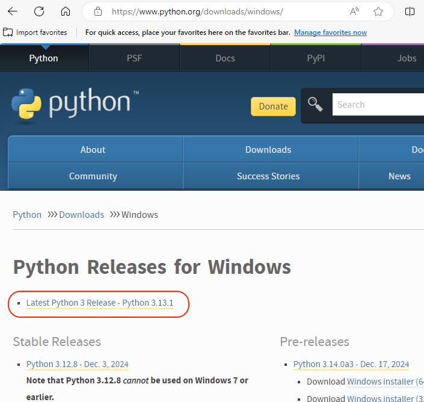
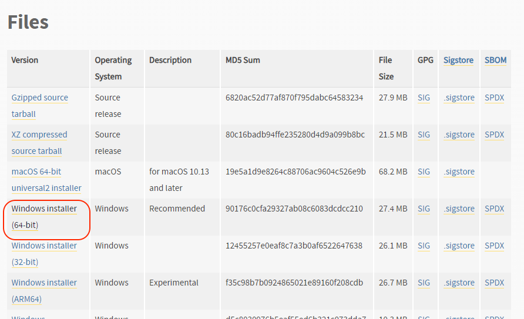
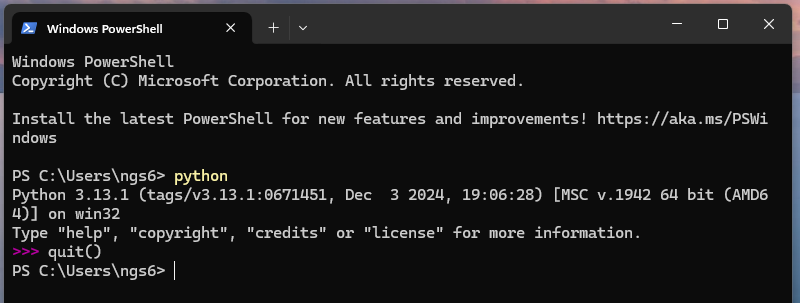

# Getting started on a Windows machine: Python

## Download python from the developer website

 Nagivate to <a href="https://www.python.org/downloads/windows/" target="_blank" rel="noopener">https://www.python.org/downloads/windows/</a> and select the latest release (3.13.1).

 

 Download the .exe file for your version of Windows (probably the 64 bit). Note that I took these pictures last year so the version numbers won't match what you see on your machine.

 

 Find the download in file explorer and double click to open the installer. Make sure to check the "Add python.exe to PATH" BEFORE you click "Install Now."

 [install-python-with-path.png](article-imgs/install-python-with-path.png)

## Check the installation

 Open the terminal, type "python" and hit enter. You should see the python interpreter text appear (see below). To exit the interpreter, type "quit()" and hit enter.

 

## Misc

 If you already installed python and didn't select the "Add to path" button when installing, you will need to add it manually. Search for "Edit the system environment variables" and click to go to settings.

 

 Select path under "System Variables" and click "Edit" (shown in red). If you are using a computer where many people have shared profiles or with limited adminisntrative access, you can select path under User variables and hit the other Edit button (shown in yellow).&nbsp;

 

 Click New on the following screen, and type&nbsp;<code>C:\Users\&lt;your username&gt;\AppData\Local\Programs\Python\Python313\Scripts\</code>&nbsp;into the textbar.&nbsp; Click New again, and type <code>C:\Users\&lt;your username&gt;\AppData\Local\Programs\Python\Python313\. </code>See the paths in the image below. Click "OK" when you are done. Repeat the steps above for checking your installation.

 
