# Getting started on a Windows Machine: Terminal

## First, install the Windows Terminal.
You probablty already have it installed by default. You can check by searching for "Terminal": <kbd>⊞ + Terminal</kbd>.

If it is not installed, use the Microsoft store to download and install. It should come up as an option in search menu, but if it doesn't <a class="inline_disabled" href="https://aka.ms/terminal" target="_blank" rel="noopener">here</a> is the link.

## Download Ubuntu and Windows Subsystem for Linux.
Open the Powershell as an administrator: Type&nbsp; <kbd>⊞ + Powershell</kbd>. Right click on the Powershell icon that pops up, and in the menu select "Run as administrator."

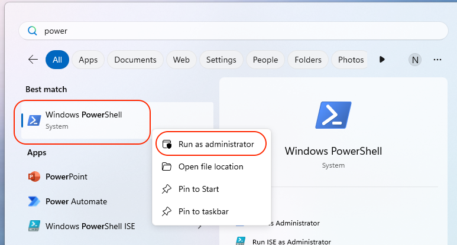

A powershell instance should pop up. Type <code>wsl --install -d ubuntu</code> and hit enter. This will initiate a download.

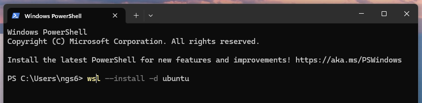

You will be prompted to create a username and password for an Ubuntu instance, and to confirm your password. Type the username and password you would like to use. Note: When typing your password what you type will not appear on the screen. You should type as normal, using the backspace key as needed, and hit enter when you are done with each prompt.

Restart your computer.

## Add WSL to the path
Search for "Edit the system environment variables" within your settings. Click on it.

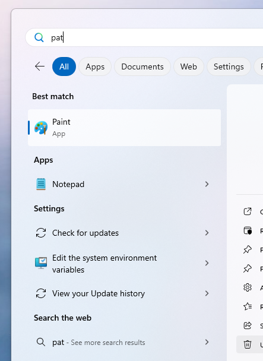

Select path under "System Variables" and click "Edit" (shown in red). If you are using a computer where many people have shared profiles or with limited adminisntrative access, you can select path under User variables and hit the other Edit button (shown in yellow).&nbsp;

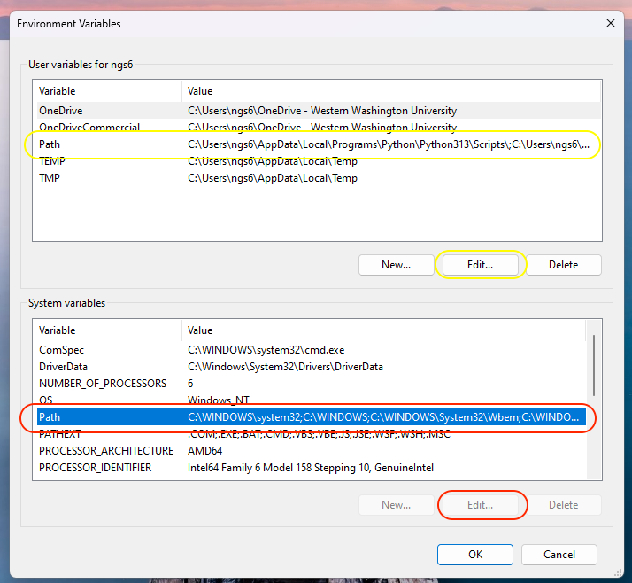

Click New on the following screen, and type <code>C:\Windows\System32\wsl.exe</code> into the textbar. Click "OK" when you are done.

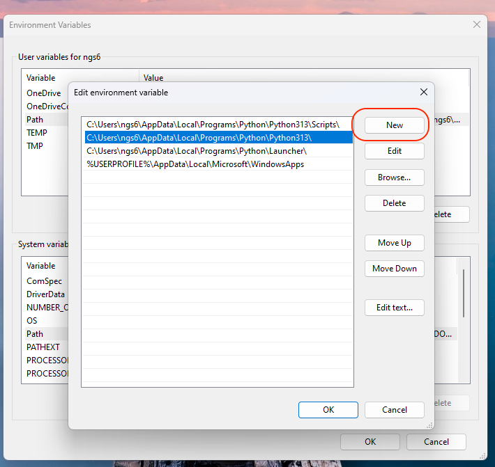

## Creating a WSL Profile
Open the Windows Terminal. Click the arrow button to the right of the tab that is open, and click on Settings.

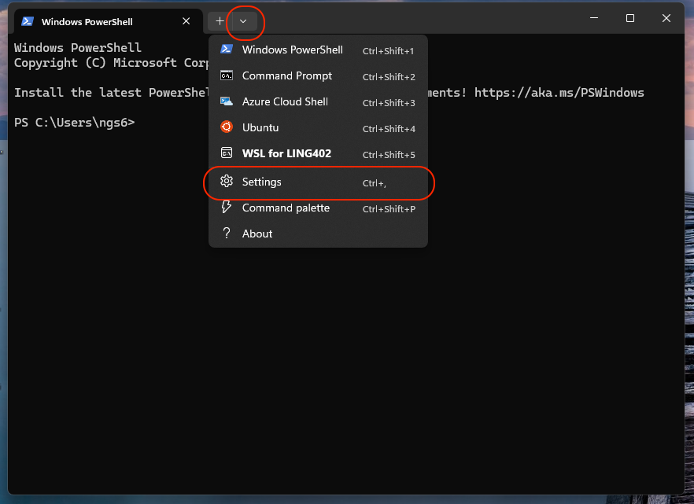

On the left menu, scroll down under "Profiles" and click on "+ Add New."

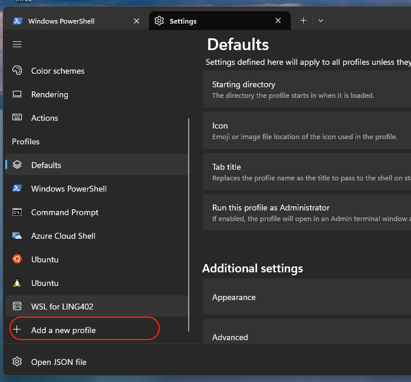

Select "+ New empty Profile" on the right side of the window. Make the following changes to Name, Command Line, and Starting Directory:

Give your profile a name

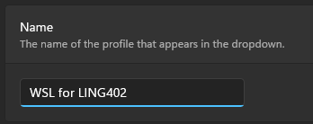

Type <code>wsl.exe -d ubuntu</code> as the value for Command line

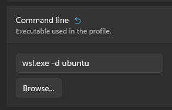

Type <code>/mnt/c/users/%USERNAME%</code> as the value for Starting directory. You will need to unselect "Use parent process directory" first.

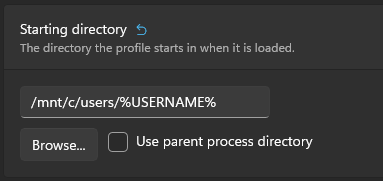

You do not need to make other changes. Save the Profile.

## Set new profile as default
Under settings, select Startup at the top of the left menu. Where it says "Default profile," select the new profiile you just created. Be sure to hit the blue "Save" button.

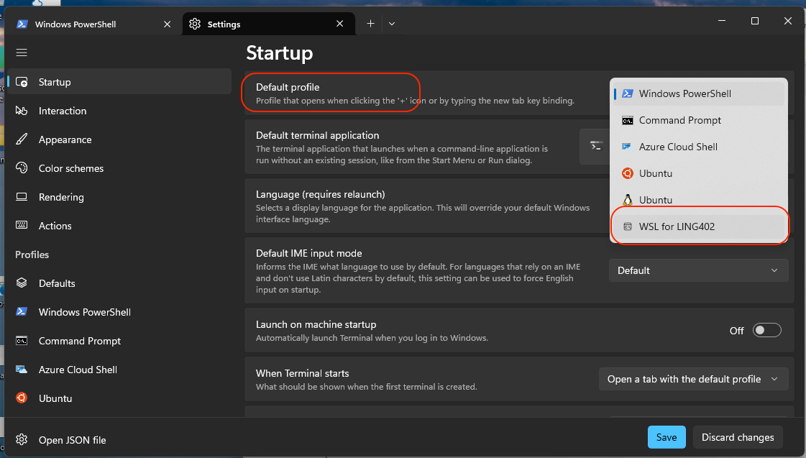

## Test desired behavior
Close out all Terminal windows. Open a new Terminal window. The title of the tab that appears should be the name of your new profile. If you type pwd into the console and hit enter, it should print <code>/mnt/c/users/&lt;your username&gt;</code>.
