<video controls="" autoplay="" name="media">
    <source src="https://sarablalockng.github.io/teaching/gramle-time.mp3" type="audio/mp3">
</video>

# Date Navigation
{:.no_toc}

* Placeholder for Table of Content (Must not be removed)
{:toc levels="1"}

# April 25, 2025

## Original Spectrogram
{:.no_toc}
I am again low on time so I'm only going to give the correct analysis. This took me four rapid fire tries.

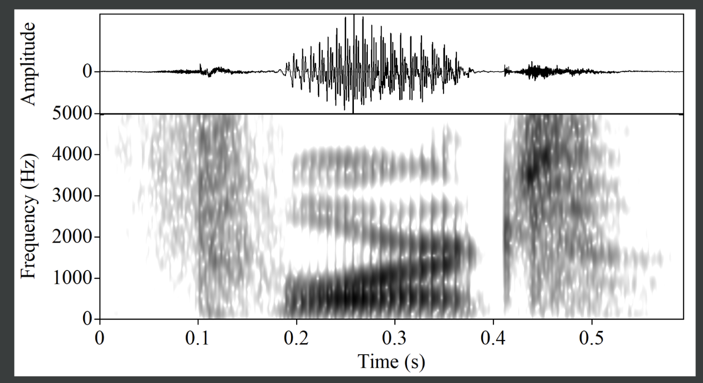

## Step 1: Segmentation
{:.no_toc}
The first bit of the noise we see is just noise, followed by a fricative. Then, there's a slightly lower amplitude region that increasese and decreases, so there are at least two sonorant segments there (there are three). Finally, there is a closure and clear release, with a fairly even spread but center around 4000 Hz. You'll see in my original segmentation I thought it may be a stop followed by a fricative for that reason.
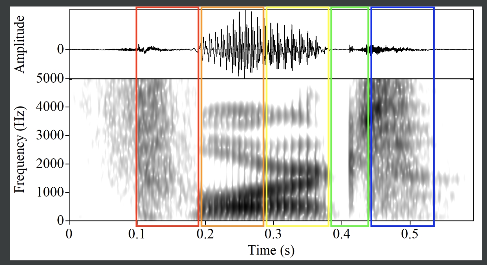

## Step 2: Voicing
{:.no_toc}

Only the center three segments have a voicing bar, the outer two do not.
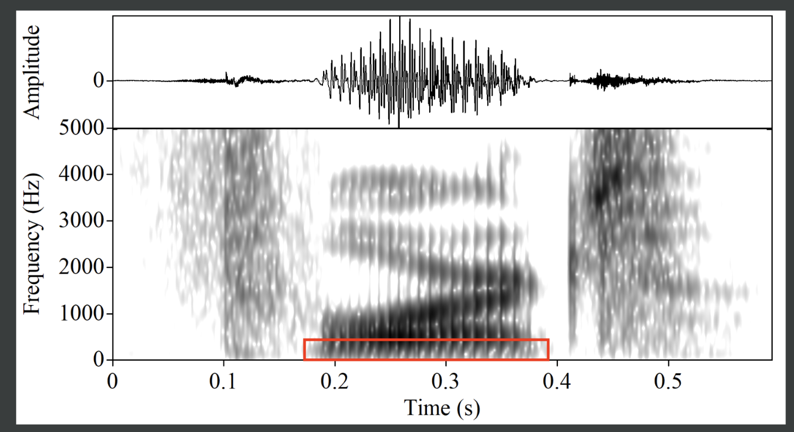

## Step 3: Manner of Articulation
{:.no_toc}

The even spread of the frequencies of the first formant tell us it's a fricative, but there's little else to go off of. Then we have a sequence of approximant, vowel, approximant. We can see that by looking at the amplitudes and the placemenet of zeros in between formants. The final segment is a stop, with a clear release burst and long aspiration, especially for the end of a word.


## Step 4: Formants
{:.no_toc}

We have really really low formants indicating an [u]-like first approximant, which is [w]. (I originally guessed an [u] for this). Since F2 stays low, the only vowel here is a back vowel. For the final approximant, we see the characteristic drop in F3 for an [ɹ]. It is easy to confuse this for velar pinch, which is what I did in my initial guesses.

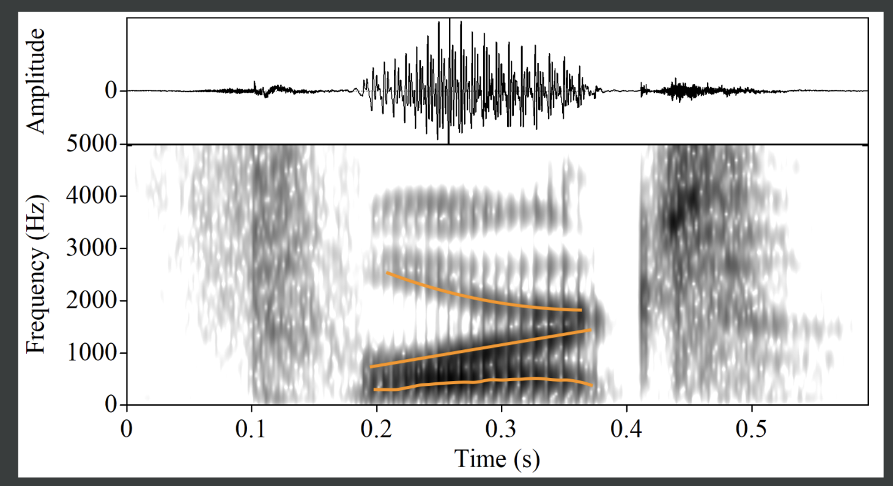

## Step 5: Guesses
{:.no_toc}
Answer:
```diff
+θ
+w
+a
+ɹ
+t
```

# April 24, 2025

Today is going to be another rapid fire day because I ran out of cat food and there's a little baby at home who needs her Salmon and Rice paté.

## Original Spectrogram
{:.no_toc}
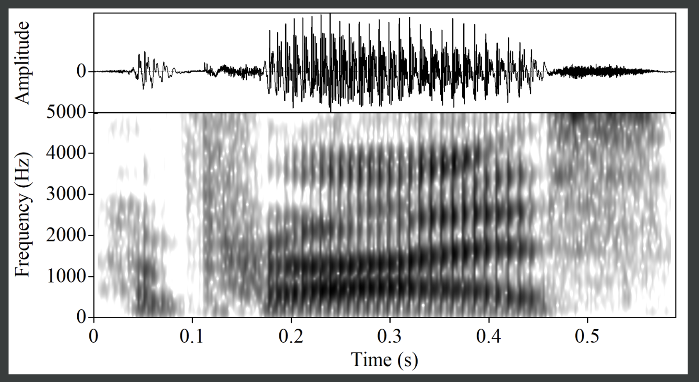

## Step 1: Segmentation
{:.no_toc}

There's weirdness at the beginning of this recording, but it looks ignorable to me. I'm only giving 4 segments because I believe theres a sequence of a vowel and an approximants in the yellow region.
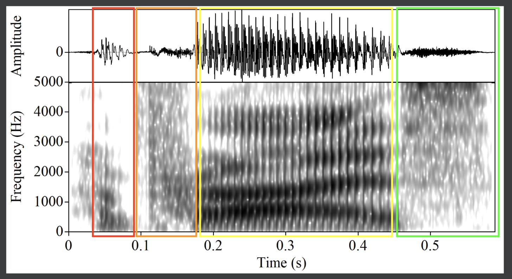

## Step 2: Voicing
{:.no_toc}

The voicing bar starts with the first segment and disappears during the closure of the second segment. It reappears for the next 2-phone formant sequence, and disappears again by the 5th segment. However, I'm going to stay curious about whether that may be final-devoicing of a phonemically voiced segment.
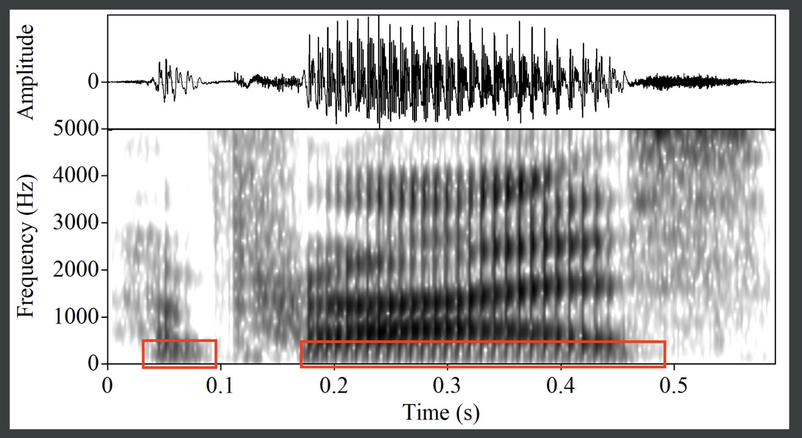

## Step 3: Manner of Articulation
{:.no_toc}
Our first phone is red has strong formants and is followed by a stop (foreshadowing), so it's a vowel. It is very short, so right away that's a clue that we've got an unstressed central vowel. The second phone in orange has a stop closure, that released into a long period of aspiration. That together with the voicing tells me that we've got either [p,t,k] at the start of a stressed stllable. For the yellow region, we can see local changes in amplitude, but the segment is loud overall. There's also a change in the amplitude of the higher order formants around the midpoint. The final segment has a high center frequency, but also looks like there may be a small closure region just before. That means it's either an affricate or a sibilant, if its an affricate it has to be [tʃ], and if its a fricative either [s,z] based on the high center ~5000 Hz.


## Step 4: Formants
{:.no_toc}

I'm guessing schwa no matter what for the first vowel because it's so short. There aren't strong formant transitions around the second segment, so I'll start by calling it alveolar and may regret that later. For the big middle section, F1 starts high and ends lower, and F2 starts low and ends high. F3 is wiggling around a lot, so there must be an [ɹ] in there.

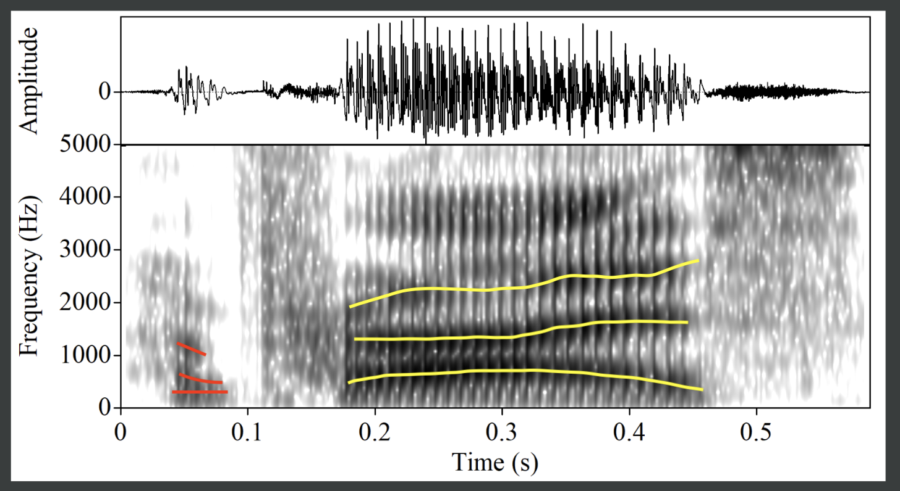

## Step 5: First Guess
{:.no_toc}
My first guess is 
```diff
+ə
-t
-a
!ɹ
-tʃ
```
Not great but not the worst.
{:.no_toc}
## Step 6-?: Revision
{:.no_toc}
I'll just keep trying voicless stops for the second segment. I can be almost convinced that F2 is moving up, so I'll say that's velar pinch for now. [ɹ] has to be the third phone. I think the low F2 and high F1 made a lot of sense for [a] though, so I'll go with the diphthong where [a] is a nucleus and F2 increases. For the fricative, I'll go with what is looks like when you don't hallucinate a closure. My second guess:

```diff
+ə
-k
+ɹ
+aɪ
-s
```

Closer, but now I know that there's final devoicing. My final guess:
```diff
+ə
+p
+ɹ
+aɪ
+z
```

Woo hooo!

# April 23, 2025

## Original Spectrogram
{:.no_toc}
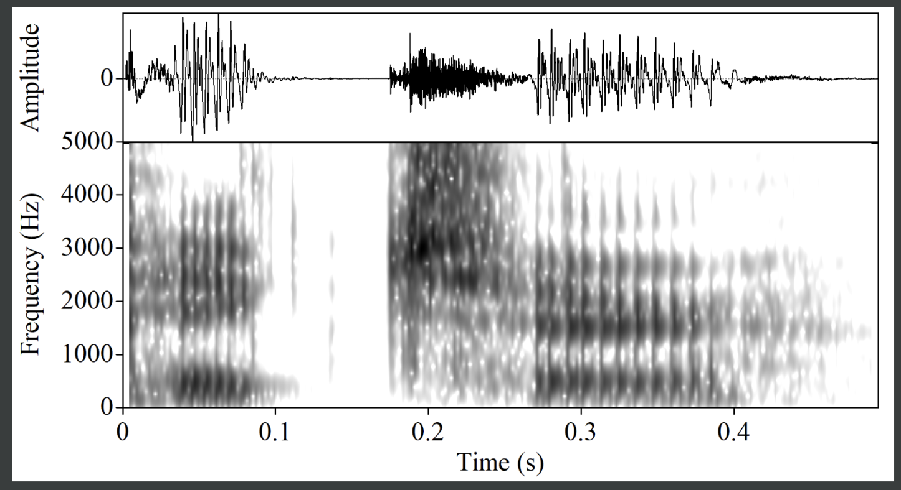

## Step 1: Segmentation
{:.no_toc}

Easy segmentation today. We've got clear regions of strong formants, next to obvious turbulent frication noise, next to closures and releases.
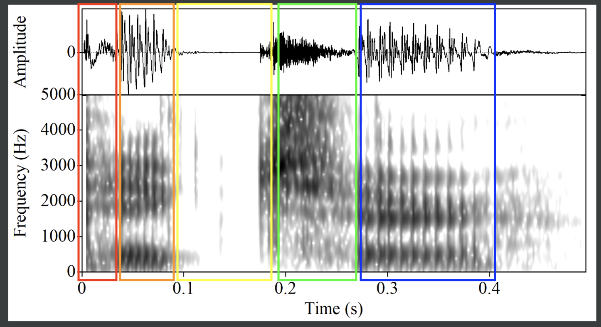

## Step 2: Voicing
{:.no_toc}
The voicing is a little trickier. It looks like voicing persists through the first two segments and the last segment. However, I'm a little skeptical about whether that voicing actually exists on the first segment.
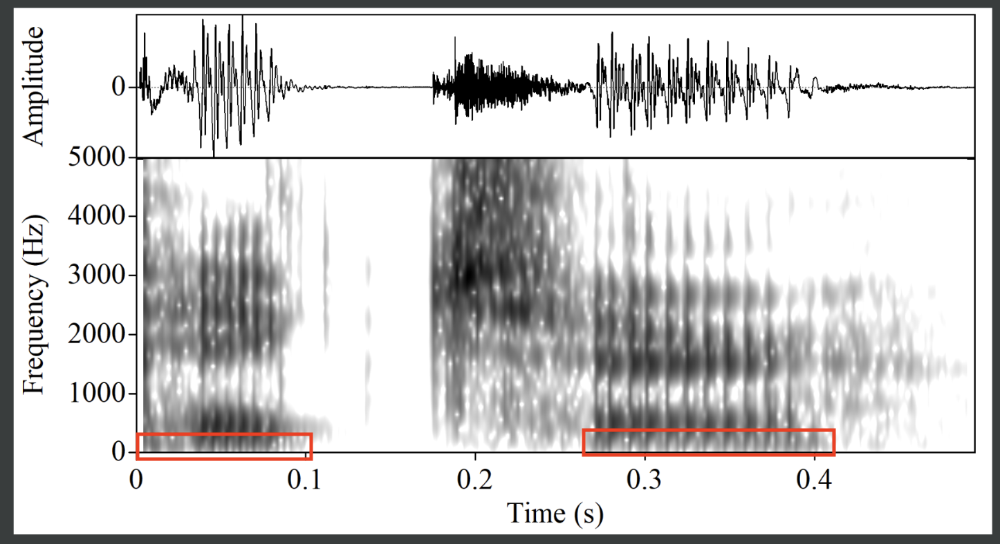

## Step 3: Manner of Articulation
{:.no_toc}
For the red segment, all we see in the spectrogram is a harsh vertical line and turbulence, with shadowy formants. In the waveform,w we see a sharp spike followed by a long, loosely-periodic cycle. While the initial spike could be due to the start of recording, I actually think it is a release burst and that this is an aspirated stop, so one of [p, t, k]. The second and fifth segments have strong formants and high amplitude, so they must be our vowels. The first is shorter but higher amplitude than the first; my guess is that that means it's a stressed, lax vowel. The third segment in yellow has a long closure followed by a short release. This is either an unaspirated voiceless stop or a voiced stop. I think phonotactics will be needed to figure out what the right voicing should be. The fourth segment has a smear across the frequencies, with a strong center around 3000 Hz. Combined with the lack of voicing I'm confident we're looking at an [ʃ]

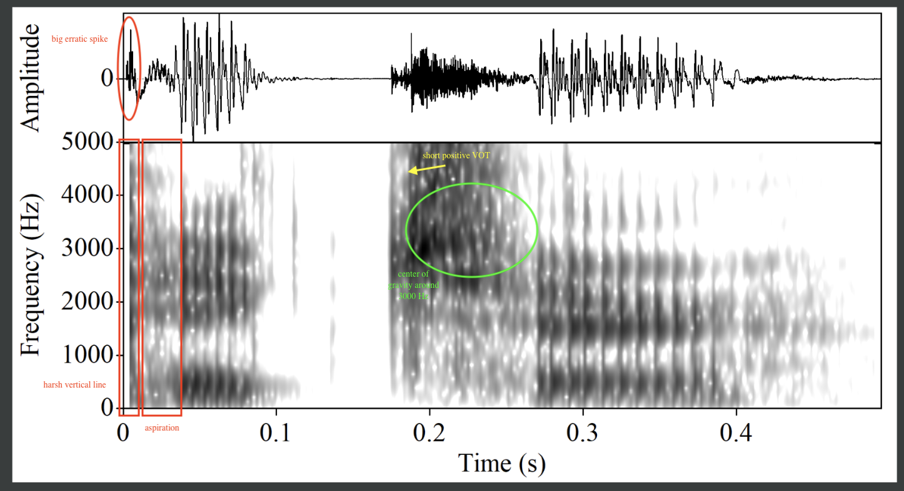

## Step 4: Formants
{:.no_toc}
I don't see any strong formant transitions going into the first segment. However for that first vowel F1 is low and F2 is high. For a lax vowel in that position we're looking at [ɪ]. On the back half of the vowel F2 and F3 really obviously curl toward one another: we've got velar pinch! So for the third segment we're looking at one of [k, g]. For the final vowel, F1 is mid and F2 looks medium-high, around 1700 Hz. I'm guessing it's some kind of central vowel, though [ɪ] is still not out of the realm of possibilty.
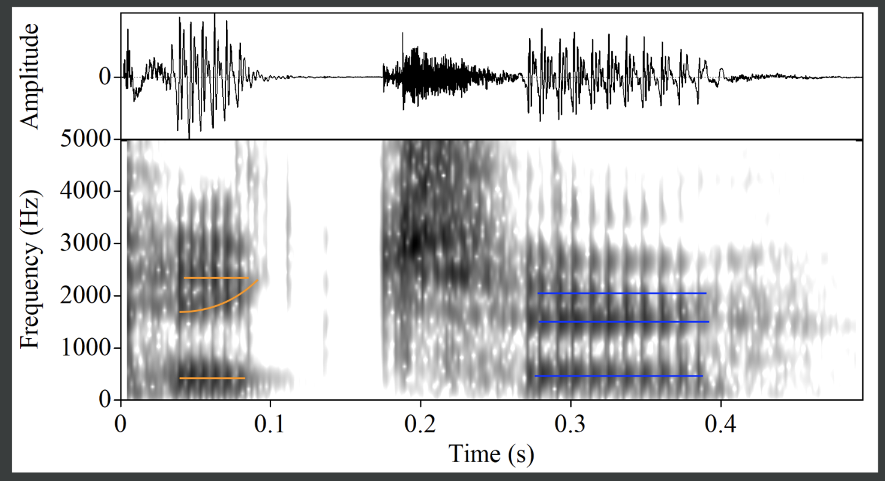

## Step 5: First Guess
{:.no_toc}

My arrogance knows no end; I must again guess a word for my first guess.

My first guess is:
```diff
+p
+ɪ
+k
-ʃ
+ɚ
```
Rats.

## Step 6-?: Revision
{:.no_toc}
I am amazed that I got the fricative wrong, I was so sure that it was [ʃ].... Oh no. I know what I did. It really does look like a [ʃ]. But what I think is going on here is that there is an unreleased [k̚] that transitions into an unreleased [t̚], and so we don't see a second closure for the [t].

My second guess is
```diff
+p
+ɪ
+k
+tʃ
+ɚ
```
## Step 7: Postmortem
{:.no_toc}

I'm not mad about that. In hindsight, I did play around with the idea of an affricate when I was sounding out \<picture\>, but what I should have though about is that multiple stops in sequence will not look like a stacked sequence of stops as they are spoken at a word boundary or intervocalically, etc.

# April 22, 2025

## Original Spectrogram
{:.no_toc}
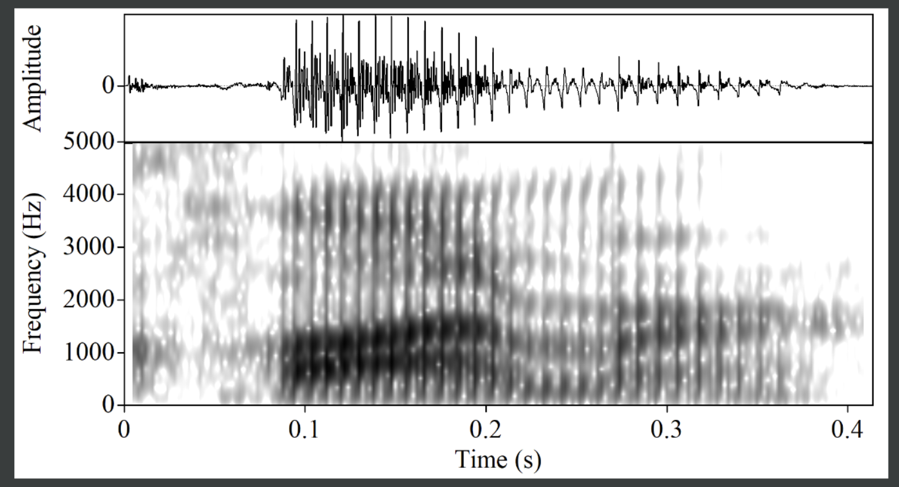

## Step 1: Segmentation
{:.no_toc}

The segmentation today is pretty tricky. You'll notice that I have annotated four regions, not five. I have several hypotheses about where the fifth segment goes:
- It's after the green phone, represented by the formants fading out and whitespace in the spectrograwm after.
- It's between the red and the orange phone, and represented by what looks like a release burst in the waveform at the point.
- It's between the yellow and the green phones, represented by what looks like a release burst in the waveform at the point.
- The orange phone is actually a vowel and approximant together, with the transition at 150 ms.

I think now that the most likely scenariod is probably the first, but I will stay curious.
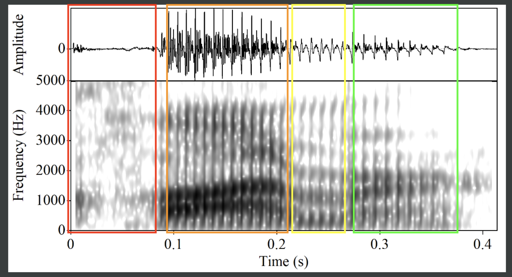

## Step 2: Voicing
{:.no_toc}
The voicing bar starts halfway through the first segment and persists until about 390 ms. I am confident that the middle segments between 90ms and 390s are all voiced, and that the first segment is unvoiced. If there's a segment after the green phone, it is either voiceless or has undergone a process of final devoiciing at the end of the word.
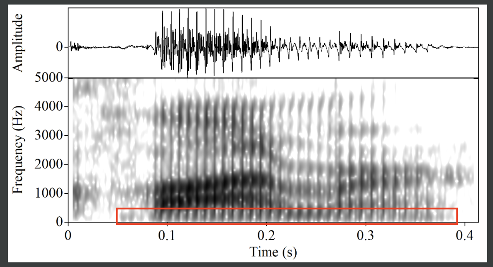

## Step 3: Manner of Articulation
{:.no_toc}

The region in red is very quiet with an irregular periodic pattern, an even spread of resonance across the visible frequencies, and very light lower formants. Together, this says to me that we're dealing with a non-sibilant fricative. The orange region is the loudest amplitude with clear formants, so that looks like our stressed vowel. The yellow region has clear formants but a drop off in amplitude, making me think we're looking either at a nasal or an approximant. The green region is short and has clear formants but with a slightly dampened amplitude. I am going to call that an unstressed vowel. I don't have a clue what could come after that. The white space makes me think a big closure like an oral stop.

## Step 4: Formants
{:.no_toc}

For the first fricative, I expect that we should see a more severe F2 curl up towards the fricative the farther back in the mouth the constriction is made. Since I don't see any movement in F2, I'm going to start with this at the front of the mouth, so [f]. For the first vowel, F2 is really low, around 1000 Hz, so we're definitely looking at a back vowel. F2 and F1 are also close together, so low F2 and high F1 would be something like [a] or a diphthong like [aʊ] or [oʊ]. For the yellow segment, all of the formants are dipping down low. That makes me think we are selecting between [m, l, ɹ, w] since all of those cause formants to droop. For the green vowel, we've got a rising F2 and mid F1. Also F2 and F3 are getting quite close by the end. I don't have good ideas of what vowel works there, besides knowing that it should be a central (aka not peripheral) one. The meeting of F2 and F3 could mean that that maybe-stop at the end is velar, so one of [k, g, ŋ].

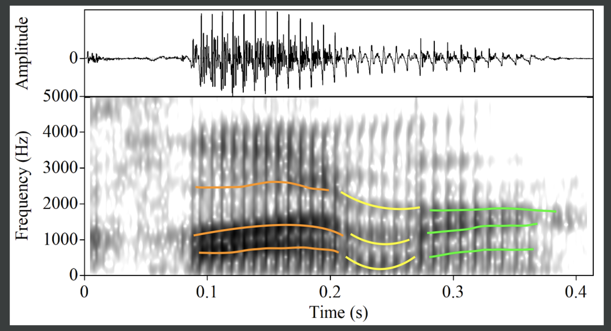

## Step 5: First Guess
{:.no_toc}

I'm going to ignore what I learned from yesterday and guess a full word again. My first guess is 
```diff
-f
-oʊ
!m
-ɪ
-ŋ
```
## Step 6-?: Revision
{:.no_toc}

Okay some good intel here. The placement issue with [m] tells me that I need to look at a different segmentation hypothesis. I think the next likely option is that there's a complex onset at the beginning of the word, and that release burst is something like an approximant or [t] being almost flapped. Phonotactically it may be something like \<thr\> in English, I think that's the only front fricative that works that way. I can't think of a word with the form [θɹ_m_] though. :( Another option would be that the region is red is the release burst for a voiceless consonant, like a \<pl\> onset. I'm going to try that and maybe I'll regret it.

My second guess is 
```diff
-p
+l
-ʌ
+m
+ɚ
```

Closer. I was right about the final central vowel, and about the quality of the nasal. My intuition about a flappy [l] seems to have paid off. Now just back to basics and phonotactics to fill in the rest. For the first segment, the turbulence is too long for a voiced stop.  I want a voiceless stop or non-sibilant fricative that can form an onset with [l]. My remaining option for that criteria is [k]. My original guesses for the stressed vowel were [a] or a diphthong like [aʊ] or [oʊ]. None of those work in the frame [kl_mɚ]. The words I can think of that fit are \<clammer\> and \<climber\>. Since the nucleus of the diphthong in \<climber\> is farther back, I'll go with that one.

My third guess is 
```diff
+k
+l
+aɪ
+m
+ɚ
```
Woohoo!

## Step 7: Postmortem
{:.no_toc}

The place of articulation of the first segment is impossible to see from the spectrogram, since the flappy [l] gets in the way of formant transitions associated with velar pinch.
In hindsight, the movement between F2 and F3 that I saw at the end of the word was not velar pinch, but a dip in F3 associated to rhoticity.

# April 21, 2025

## Original Spectrogram
{:.no_toc}
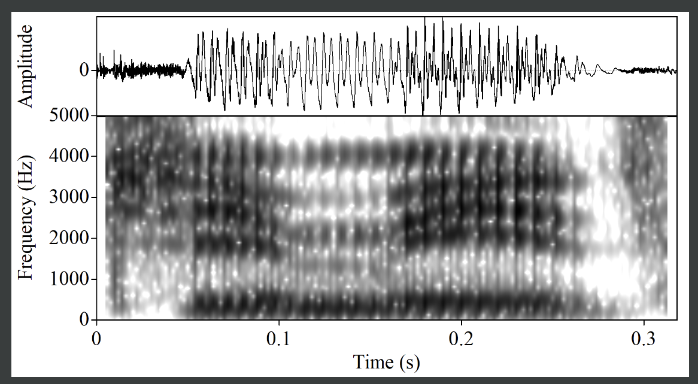

## Step 1: Segmentation
{:.no_toc}
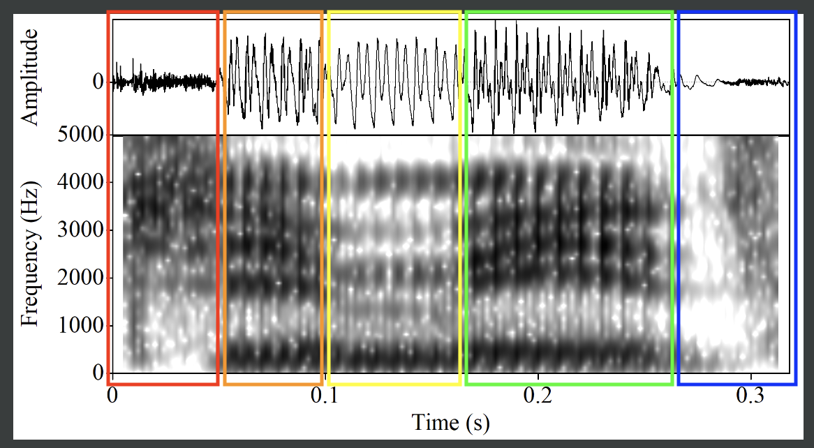

A nice and easy segmentation today. The big cues one how to divide this one up are:
1) Are there visible formants?
2) Is there a noticible change in amplitude?

## Step 2: Voicing
{:.no_toc}
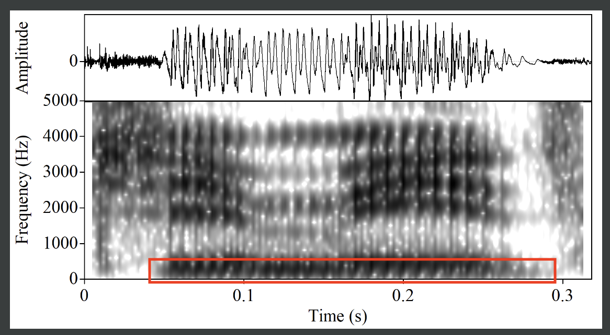

There is a voicing bar that starts during the second phone and persists through the closure of the last phone. Combined with the formants, this is good evidence that middle three phones are voiced. For the final segment, I'll say for now that it is voiced but stay curious about whether there is bleed through from the previous vowel.

## Step 3: Manner of Articulation
{:.no_toc}
Manner of articulation for the 1st, 2nd, and 4th segments is quite clear on this gramle. The first phone has high frequency frication noise, with a center of gravity around 3500 Hz. Combined with its position in the beginning of the word and lack of voice bar that make it unambiguously a [ʃ[. For the second and fourth, these have dark formants and high amplitude so they must be the vowels. The 4th segment is longer and higher amplitude, so I bet that one is the stressed vowel. The third segment has formants and a relatively high amplitude, but not as high as the surrounding vowels. Either it is a nasal or an approximant, but given the amplitude I'm slightly learning toward approximant. The final segment looks like a word-final stop to me, Maybe voiced given how the voicing bar extends.

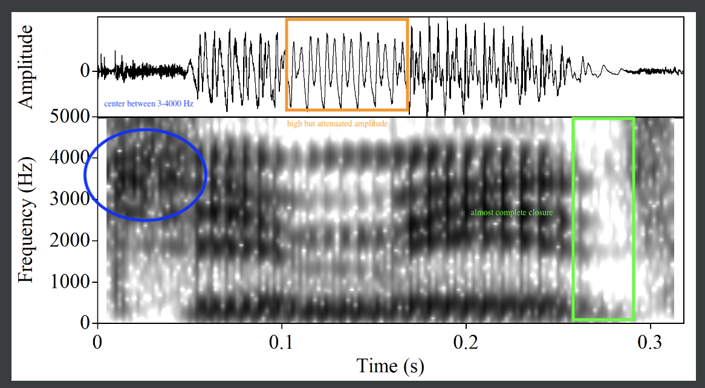

## Step 4: Formants
{:.no_toc}


For the first vowel, F2 is high (until a formant transition) and F1 looks fairly low. That puts us in the high front of the vowel space, maybe [ɪ] since it's in unstressed position. The third segment has a dip in F3 and F2 that's pretty severe and influencing the vowels on either side. That makes me think we're dealing with [l] or [ɹ]. For what I'm calling the stressed vowel, F2 is even higher, and F1 is in the same place. Towards the final segment, F2 and F3 are dipping down, which could indicate a bilabial like [p] or [b].

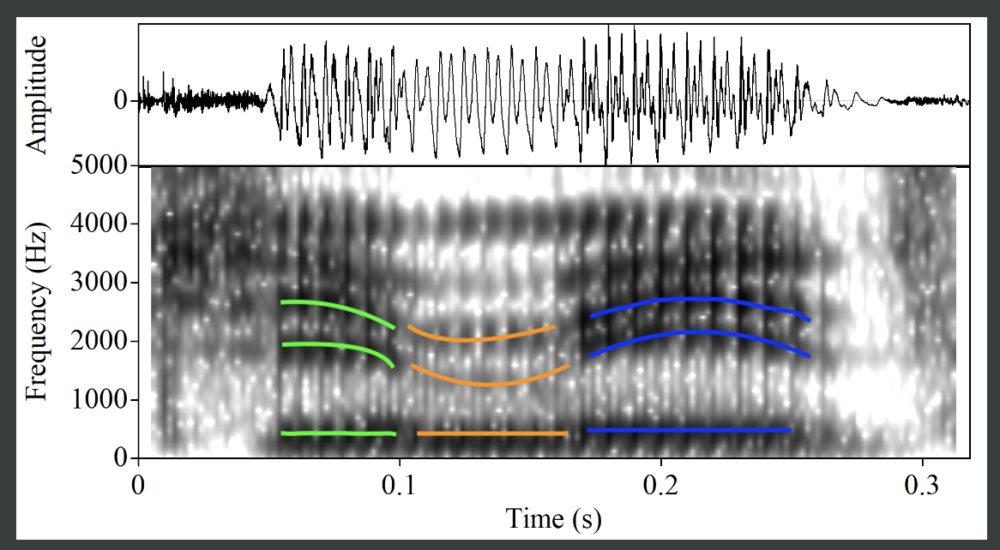


## Step 5: First Guess
{:.no_toc}

My first guess is 

```diff
-ʃ
+ɪ
-ɹ
+i
-b
```
## Step 6-?: Revision
{:.no_toc}
I am really surprised about the first segment based on the frequency. I am now wondering if it is an affricate with a sneaky hard-to-see release burst at the beginning of the spectrogram. For the middle segment, I still have [l] that I was thinking about earlier. For the final segment I am not seeing velar pinch, but I like the idea of this segment remaining voiced since that would induce vowel lengthening of the [i] which we're seeing. What if it's not a stop, but a fricative? Sometimes there's little puffs of air that get created while moving the tongue in place for a fricative. That would help me make a complete English word...

My second guess is 
```diff
-tʃ
+ɪ
-l
+i
-z
```

Classic. I got too excited to make a word and made mistakes. I'm going to go back to basics and regroup. The beginning is either an affricate or a fricative, and it has a medium-high center of gravity and no voicing bar. It could be a low [s]. The third segment is a nasal or approximant based on amplitude and formants. Maybe the downturn in higher formants is from labialization, so [m] or [w]. For the final segment I'll go back to my idea of a non-velar voiced stop, so [d].

My third guess is 
```diff
-s
+ɪ
+m
+i
+d
```

What is going on on that first segment? I can't even think of a word that works here... Oh. I think what I saw as stress on the final vowel was just influence of the subsequent voiced stop on the vowel's length. With the first vowel stressed I can get \<jimmied\>, which is consistent with my belief in a sneaky closure and fricated release burst for the first segment.

My fourth guess is 
```diff
-dʒ
+ɪ
+m
+i
+d
```
Woo hoo!
## Step 7: Postmortem
{:.no_toc}
Okay I need to put a post-it on my computer that says ``don't get excited and guess words that don't match the acoustic information.'' The only part of my analysis that changed between guesses was to include a release burst at the very beginning. Overall I think if I were less arrogant I could've gotten it in three, but then aggain if I had been arrogant a second time I might have also gotten it in three. 😏


# April 18, 2025

## Original Spectrogram
{:.no_toc}
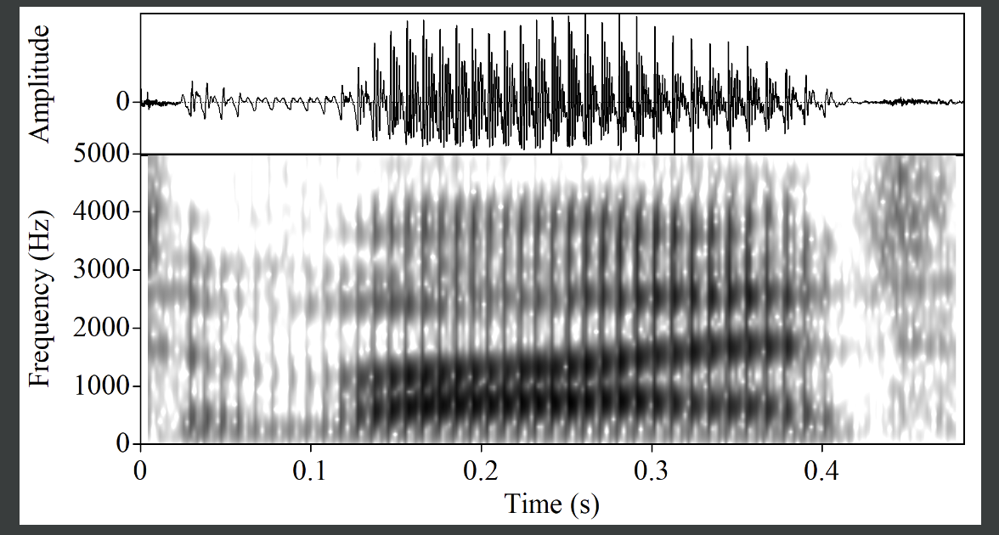

Today's spectrogram is special because it was 1) really hard!, and 2) I got to do it with a Phonetics student! It took us all five tries, with a little cheating.

Instead of walking through the process, I'm just going to show the guesses that took us to the final answer, and then provide the postmortem.

First guess:
```diff
-l
-a
-oɪ
-ɚ
-d
```

Second guess:
```diff
-n
-oʊ
-ɹ
!ɪ
-ʃ
```
Third guess:
```diff
-h
-u
-m
!ɪ
+d
```
Fourth guess:
```diff
-w
+ɪ
-ŋ
-ə
+d
```
Fifth guess:
```diff
+d
+ɪ
+v
+aɪ
+d
```

## Postmortem
{:.no_toc}
The segmentation is the most difficult thing about today's gramle. We originally that that the burst at the beginning may have been due to recording cutoff, so we weren't considering it as a segment until the very end. The first vowel is also incredibly short. In addition, the formants persisting through the [v], and the looooong diphthong make the segmentation and placement extra confusing. 
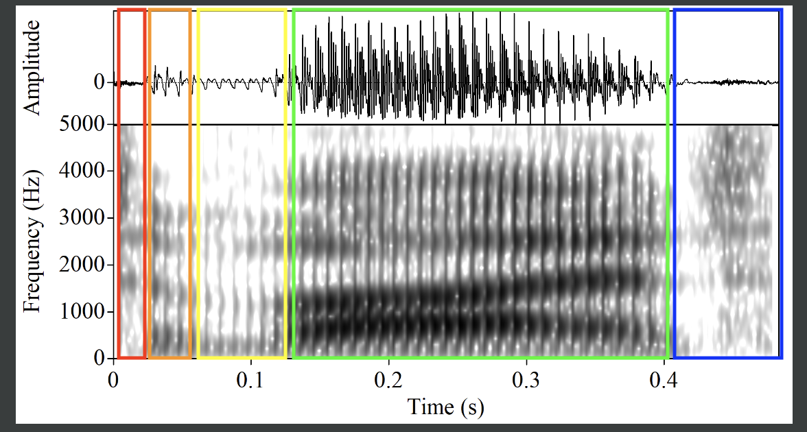

The final [d] is weird for a [d] but looks fairly typical for a [d] in word-final position. By guess 4, we agreed that the path we were going down wasn't working and we had to change our segmentation. At that point, we started thinking more seriously about vowel quality. The formants don't have strong transitions from the 1st or 5th segment, making the stops look alveolar. The first vowel has a lower F1 and higher F2, making it a good spot for [ɪ]. The long vowel has to be a diphthong; it's too long for anything else. It has an increasing F2, making [aɪ] and [oɪ] the most likely options. F1 has an arcing pattern downward, which could indicate either of those nuclei. We had a little help guessing [v] for the low amplitude segment, and then phonotactics helped us settle on [aɪ].

# April 17, 2025

## Original Spectrogram
{:.no_toc}
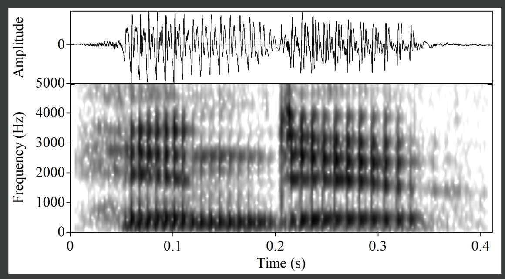

## Step 1: Segmentation
{:.no_toc}

It looks like we're back to easy segmentations. We've got a region with some very shadowy formants from 0 to 50 ms, followed by obvious formants (orange) that drop off in amplitude and resonance by ~110ms (yellow). Then, there's a closure and release burst into a very short aspiration (green), and transition at 225ms into a strong formant segment.
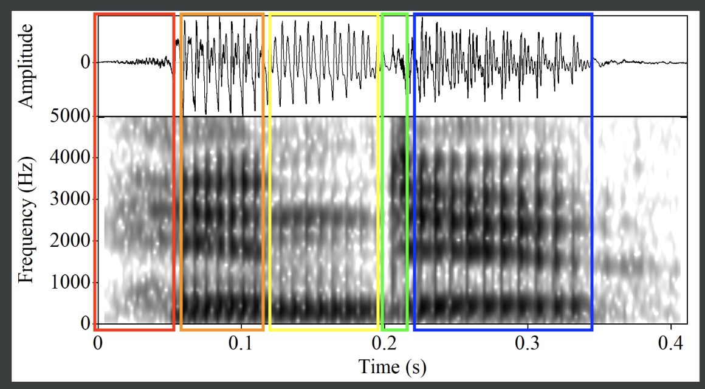

## Step 2: Voicing
{:.no_toc}

The voicing bar looks like it starts around 40ms, meaning that all segments except the first should be voiced. It even persists through the closure at 200 ms, a good sign that the stop there is voiced.
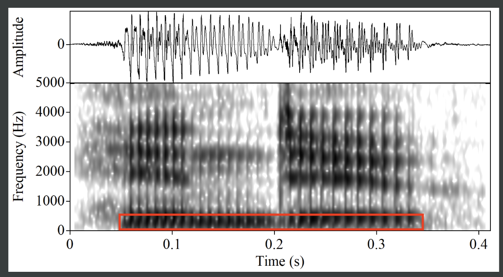

## Step 3: Manner of Articulation
{:.no_toc}
I believe we're looking at an approximant, vowel, nasal, stop, vowel sequence. For the first segment, there is a smear of the frequencies, but also some faint formants visible. Put together that is strong evidence for a [h]. The second and fifth segments have very strong formants and high amplitude. The first has highest amplitude so it probably has primary stress. However, the fifth segment is still fairly high amplitude and long. I think that means that we either have a non-central unstressed vowel, or a secondary stress (like a compound word). The third segment's clear voicing, lessening in amplitude, and loss of peakiness in the formants make me think that this is nasal. And as implied earlier, the stop closure and short VOT of the fourth segment mean we are clearly looking at a voiced stop, either [b,d,g].


## Step 4: Formants
{:.no_toc}

This spectrogram has some really consisdent formants. They basically look completely horizontal until you get to the end of the word. I think that means we're not dealing with any diphthongs, nor any places of articulation that tend to curl the formants like bilabials and velars. That really helps narrow down the consonants. For the first vowel, we've got what looks like a mid-low F1 and a very high F2, putting us in the high-front space. Achieving a true [i] before a nasal is odd for English, not to mention it's pretty short for [i], so I'll go with [ɪ]. For the nasal, the lack of formant transitions makes me confident that this is an [n]. For the same reason, I think our voiced stop is a [d]. For the final vowel, we have pretty similar F1 for a higher vowel, and a high falling F2. I'm going to assume that drop is because of the mouth opening at the end of the word, and say that it's [i].
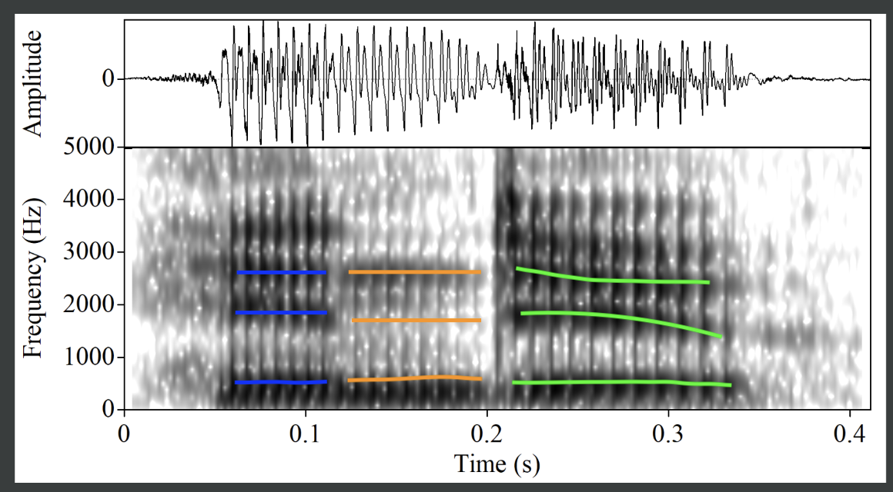

## Step 5: First Guess
{:.no_toc}

My first guess is 

```diff
+[h]
+[ɪ]
+[n]
+[d]
-[i]
```
Close!

## Step 6-?: Revision
{:.no_toc}

The only words I can think of that satisfy what I've got so far are \<hinder\> and \<Hindu\>. Neither of those vowel qualities match my expectations for the formants. I don't see F3 wiggling around like I would expect for a rhotacized vowel. F2 seems very high for [u], but maybe that's /u/-fronting? \<Hindu\> also has a secondary stress, which is what I was thinking about.

My second guess is 

```diff
+[h]
+[ɪ]
+[n]
+[d]
+[u]
```

Wooohooo!

## Step 7: Postmortem
{:.no_toc}

There weren't a ton of surprises other that the F2 of the final vowel. I think my takeaways is as always: weird things happen at the end of a word.

# April 16, 2025

Today's spectrogram is a bit of an oopsie in that I didn't actually type in my answer in time before the page refreshed, so I don't know what the right word is :( Nevertheless here is my analysis.

## Original Spectrogram
{:.no_toc}


## Step 1: Segmentation
{:.no_toc}


## Step 2: Voicing
{:.no_toc}


## Step 3: Manner of Articulation
{:.no_toc}


## Step 4: Formants
{:.no_toc}


## Step 5: First Guess
{:.no_toc}
## Step 6-?: Revision
{:.no_toc}
## Step 7: Postmortem
{:.no_toc}
# April 15, 2025

## Original Spectrogram
{:.no_toc}
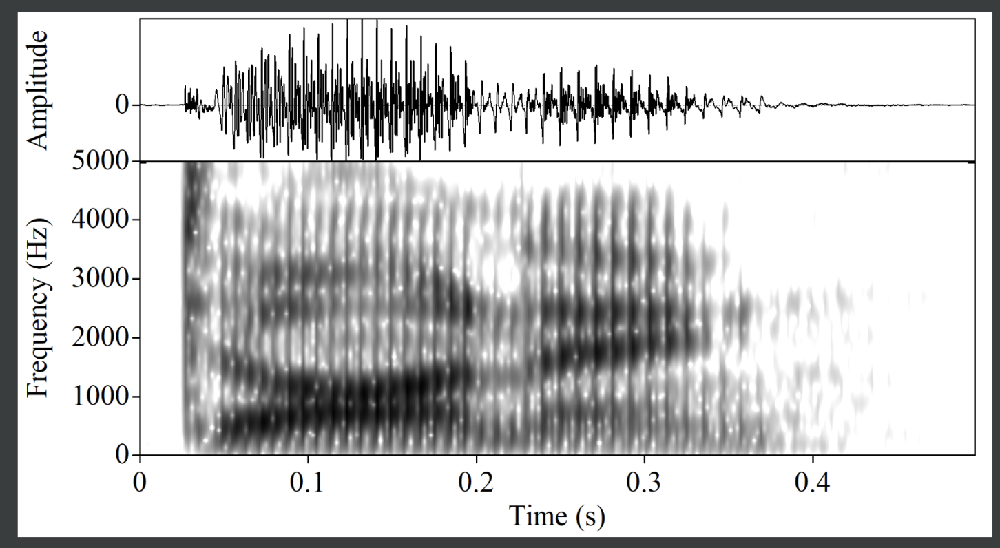

## Step 1: Segmentation
{:.no_toc}

To me, this looks like we've got a strong closure and release burst, followed by a long period with visible moving formants. Then, the formants remain visible but the amplitude get much weaker. After that, the amplitude increases again but doesn't achieve the same darkness as before, and wide vertical striations appear which indicate some creaky phonation.  Given this, I think there are two possible segmentations. In the first, the long sonorant region contains both a stressed vowel and an approximant like [l], [w], or [ɹ].
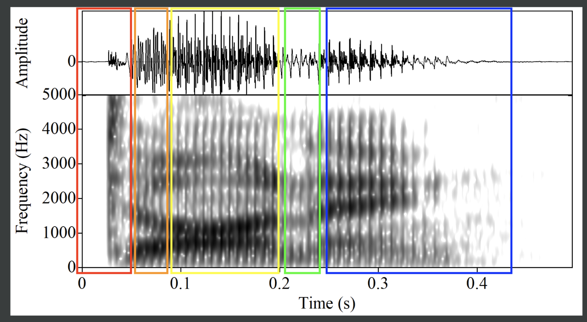

In the second, there is a sneaky closure at the end of the word, that is causing the creakiness to be prominent

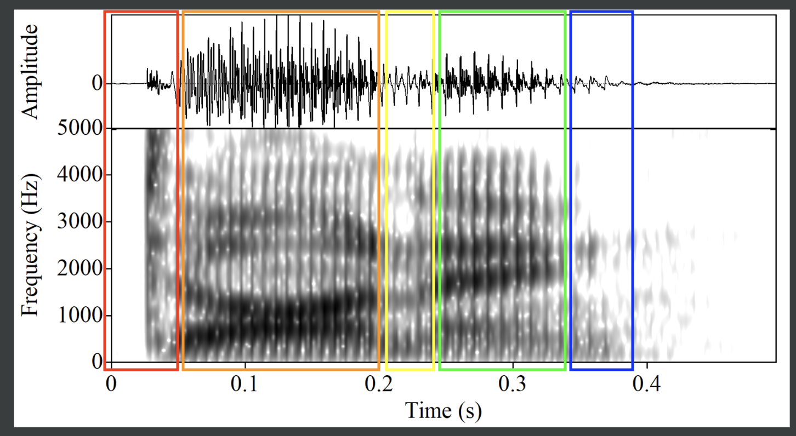


## Step 2: Voicing
{:.no_toc}

There is a voicing bar through all the sounds except the first. However, the time between the closure and the onset of voicing (VOT) is very short. If the stop were voiceless, it should be aspirated word-initially which would have a very long VOT. That makes me suspicious that this is a short-lag VOT sound, meaning all the segments (except in the case of a final stop) would be voiced.

## Step 3: Manner of Articulation
{:.no_toc}

The first segment is obviously a stop, with a clear closure and release burst. I believe if there is an approximant in the first long sonorant region it is at the beginning, where the amplitude is a little less. Then, there is a stressed vowel: it is high amplitude with clear formants. The next segment is either a nasal or an approximant. It has a low amplitude, especially around the formants, but has strong formant pattern still with little turbulence. There are what look like nasal zeros high up, and a dip in the formants overall. Finally the last region with clear formants and low amplitude is an unstressed vowel, possibly followed by something else.


## Step 4: Formants
{:.no_toc}
In the transition from the first segment, it looks like F2 and F3 get really close together before moving apart. This is good evidence of a velar sound like [g]. Then they move to a position where F1 and F2 are close together: with F2 being especially low. I'm guessing then we're dealing with a back vowel, or potentially a diphthong that starts back and moves its way front. If there's an approximant before phonotactically both [l] and [ɹ] make sense between a [g] and a back vowel. The dip in the formants for the low amplitude region after that makes me think about lengthening the vocal tract, like for [m], or the dip in F1 we would expect for [l]. Finally, the formants of the last sonorant region increase through the mid-high F2 range, and slightly decrease in a mid F1.
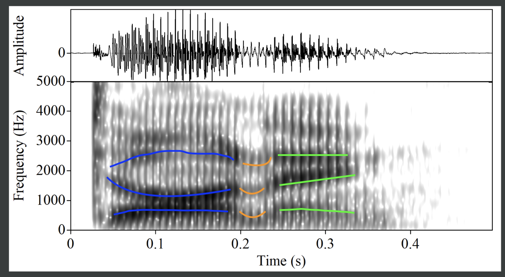

## Step 5: First Guess
{:.no_toc}

I want to guess a word for my first guess, so I'll go with <grimey>, even though the vowels don't quite match my expectations:

```diff
-[g]
-[ɹ]
-[aɪ]
-[m]
-[i]
```
Rats.
## Step 6-?: Revision
{:.no_toc}
For the first segment, that leaves me with [b] or [d] if I want to stay voiced. The fanning between F1 and F2 could indicate an alveolar, but that doesn't work well with my hypothesis of an approximant after. The other possibility is that this is a [k], that is not very aspirated because there's an approximant after. This time I'll try [l] for the approximant, and use the formants to guess my vowels. I'll try another nasal for the middle segment as well.

My second guess is 
```diff
-[k]
-[l]
![a]
![n]
-[ɚ]
```
That positioning says to me that the second hypothesized segmentation is the right one. But what is going on in that first segment? I'll go back to my guess that the first segments transitions indicate the aleveolar [d]. Then I'm looking at

[ d a n [unstressed vowel] [something else]].

I'm playing around with pronouncing, and none of the stops seem to work in that "something else" position. However, I can get the words \<donner\> (one who dons) and \<donning\>. Since schwar counts as one segment I'll try the latter.

My third guess is 
```diff
+[d]
+[a]
+[n]
+[ɪ]
+[ŋ]
```
## Step 7: Postmortem
{:.no_toc}

In hindsight, I was right to consider multiple segmentations, and the engma at the end was hard to see but there. I think I drew the formant tracking of the nasal in the middle curvier than it actually was, which threw me off as well.

# April 14, 2025

I need to get caught up from a weekend away so today is a rapid fire analysis.

## Original Spectrogram
{:.no_toc}
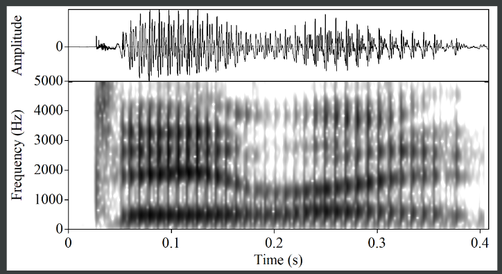

## Step 1: Segmentation
{:.no_toc}
Now look, I know there's only four segments here, but hear me out. I think the last region (in green) is very sonorant with very smooth transitions. It's very long too. But there are no cues anywhere within that region that make it look separable. I think that either this is a vowel + a very sonorant coda, or it's a diphthong and an invisible coda (not unheard of with gramle spectrograms because of how the forced alignment grabs words. The first segment is clearly differentiable thanks to its closure and aperiodic release burst sequence. The orange region has strong formants and a lack of nasal zeros. The yellow region is markedly different primarily thanks to lower amplitude in the spectrogram and the waveform, and the lowering of the formants

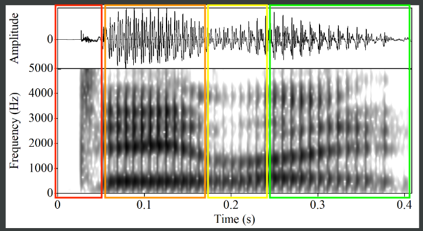

## Step 2: Voicing
{:.no_toc}
There is a voicing bar through all the sounds except the first. However, the time between the closure and the onset of voicing (VOT) is very short. If the stop were voiceless, it should be aspirated word-initially which would have a very long VOT. That makes me suspicious that this is a short-lag VOT sound, meaning all the segments would be voiced.

## Step 3: Manner of Articulation
{:.no_toc}
The first segment is obviously a stop, with a clear closure and release burst. The second segment looks like a stressed vowel: it is high amplitude with clear formants. The third segment is either a nasal or an approximant. It has a low amplitude, especially around the formants, but has strong formants pattern still with little turbulence. The fourth segment is either a vowel and then an approximant or a dighthong and a secret stop.

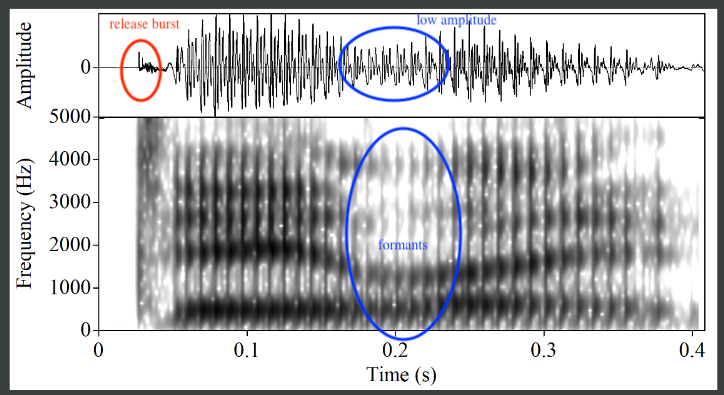

## Step 4: Formants
{:.no_toc}
The first segment does not seem to have induced any formant transitions; they're really stable at the beginning of the first vowel. Since there's neither velar pinch nor bilabial downturning, I think I will exclude [b, g] hypotheses and go with [d]. The first vowel has very high F2, so it's clearly in the front of the vowel space. It's also very long, which could either be because of its stressed position or because it's a diphthong. The formant trajectories are very horizontal, which makes me think [i, ɛ, ɪ] though the diphthong [eɪ] doesn't move that much. For the third segment, F2 is doing a fairly severe dip, with F3 and F4 following along for the ride. The phones [m, w] will dip the formants because of rounding, but so do the approximants [l, ɹ] (though for ɹ I would really just want to look at F3). For the last segment, F1 looks fairly low, and F2 starts low and ends high. That could mean we are either looking at a low back vowel like [ɑ] or a diphthong that moves forward like [aɪ] or [ɔɪ].
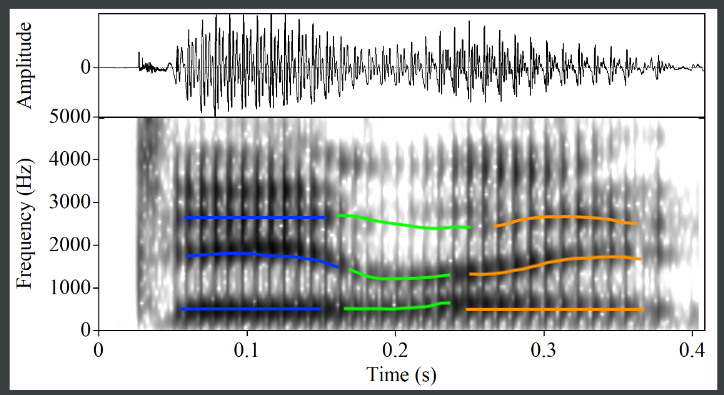

## Step 5: First Guess
{:.no_toc}
Because I'm suspicious of [m] and [l] for the third segment, I'm going to game around and use them both in plausible positions. My first guess is 

```diff
+d
+eɪ
-m
-a
!l
```

## Step 6-?: Revision
{:.no_toc}
Almost there. My gambit worked, and now I'm confident that the third segment is [l]. The only other approximant that could go in the fifth position phonotactically is [ɹ], and I don't think there's a word that makes that make sense. So back to the diphthong hypothesis. Between [deɪlaɪ_] and [deɪlɔɪ_], the only word I can think of is \<daylight\>.

My second guess is 

```diff
+d
+eɪ
+l
+aɪ
+t
```
Woo hoo!

## Step 7: Postmortem
{:.no_toc}
I think the big takeways about why this one was successful are:
* English "voiced" consonants tend to have a short lag VOT in lieu of a voicing bar
* the segmentation can be tricky in gramle, and weird things happen at word boundaries

# April 10, 2025

## Original Spectrogram
{:.no_toc}
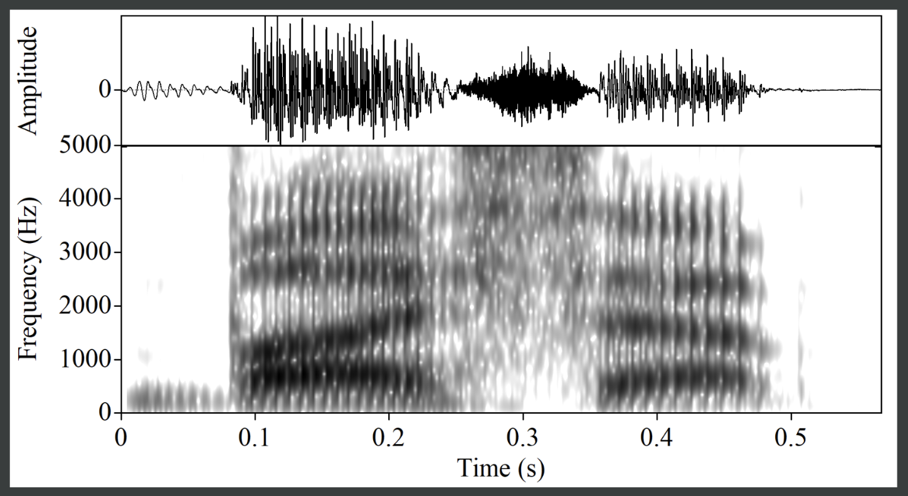

## Step 1: Segmentation
{:.no_toc}
Unlike yesterday, I am quite confident in the segmentation here. We have a strong pattern of changes in formant transition and another strong pattern of changes in amplitude of the waveform. From 0 to 80 milliseconds (red), there is low amplitude and no visible formants. Then from 80 to ~225 ms (orange), we have our highest amplitude in the waveform for this word, with clear formants. From 225-250 ms (yellow), the amplitude does a steep drop off. The formants are still visibe, but faint, and there's some zeros visible between the formants. From 250-350 ms (green), we no longer see formants, but a aperiodic pattern with concentrated frequencies. Finall from 350-475 ms, we have a medium amplitude sound with very visible formants.

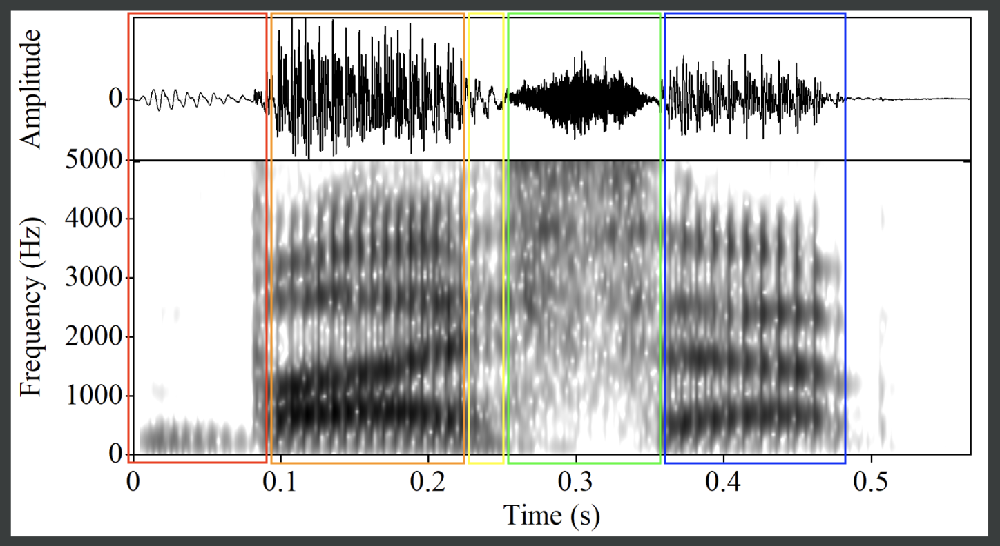

## Step 2: Voicing
{:.no_toc}
There is prevoicing of the first segment, which persiss until ~ 300ms, drops, and picks back up by the 350 ms point. I suspect that because the voicing doesn't persist through the entirely of the centeral turbulent segment, that that segment is not actually voiced but that the voicing bar is bleed-over from the previous segment. This could even be true for the short segment before this one as well.

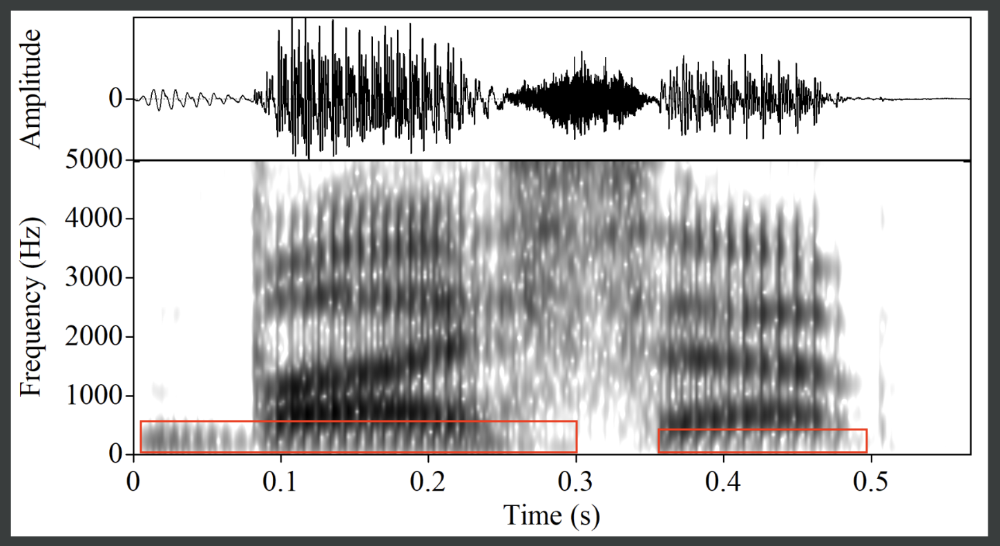


## Step 3: Manner of Articulation
{:.no_toc}
The combination of prevoicing, a visible release burst in the waveform, and a short VOT make me very certain that the first segment is a voiced stop, one of [b], [d], or [g]. The visible formants, amplitude and length of the second segment look like a stressed vowel, possibly a diphthong. The third segment is tricker. We want something that has visible formants, low amplitude, and short. I'm thinking either a nasal, an [h], or an [l]. This is phonotactically a weird place for [h], so let's zoom in on nasals and l. The fourth segment is clearly some kind of fricative. It has a high concentration of energy in the higher frequencies, towards 5000 Hz, with a white gap in the lower frequencies. If I combine this information with the voicing hypothesis above, I think we're looking at [s]. For the final segment, the visible formants and low amplitude make this an unstressed vowel. There is glottal pulsing consistent with word-final creaky voicing, but I don't think that's a good hint about the specific vowel we're dealing with. 

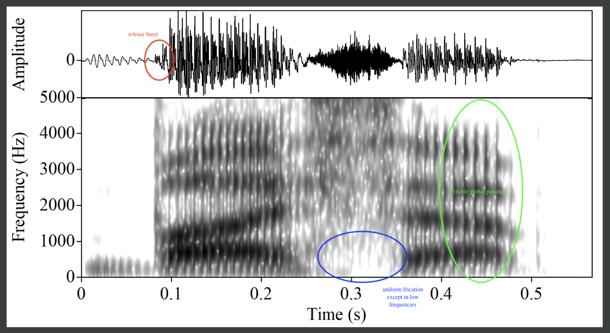

## Step 4: Formants
{:.no_toc}
The place of artculation of the first segment is going to be determined by the formants of the vowel after it.  For [b] I would expect formant lowering toward the release, which I can definitely see in F3 and F4, and I can convince myself of for F1. For the alveolar the transitions are more dependent on the quality of the following vowel, so I'll ignore that unless I need it. For [g], I would want to see velar pinch between F2 and F3, but there's a huge gap between F2 and F3 here.

For the stressed vowel, it looks like F1 is on the high end of the range and fairly consistent, so I think we're looking for a mid-low or low vowel. F2 shows a transition for 1200-2000 Hz. Part of that is the velarization I think, but could also mean a frontward-trending diphthong. The diphthongs with a low or midlow nucleus are [aɪ], [aʊ], [ɔɪ], and [oʊ]. Of those, [aɪ] and [ɔɪ] move frontward.

Let's look at the transitions toward the third segment. After a vowel, I would expect an [l] to be velarized. We do see velar pinch here, so that's good evidence that this is likely [l] or [ŋ]. The rise of F2 is inconsistent with a presentation of a bilabial like [m], so I'm eliminating that candidate. Diverving F1 and F2 is possible for alveolars like [n], but again is depending on preceding vowel quality so I don't want to consider that right away.

For the fifth segment, there's a lot of movement in the formants, especially F3. The could mean that this sound is rhotic, like schwar [ɚ]. F1 is relatively high and F2 decreases through its range. I don't have any strong hypothesis about this vowel quality. I might save that for phonotactics when I have more information

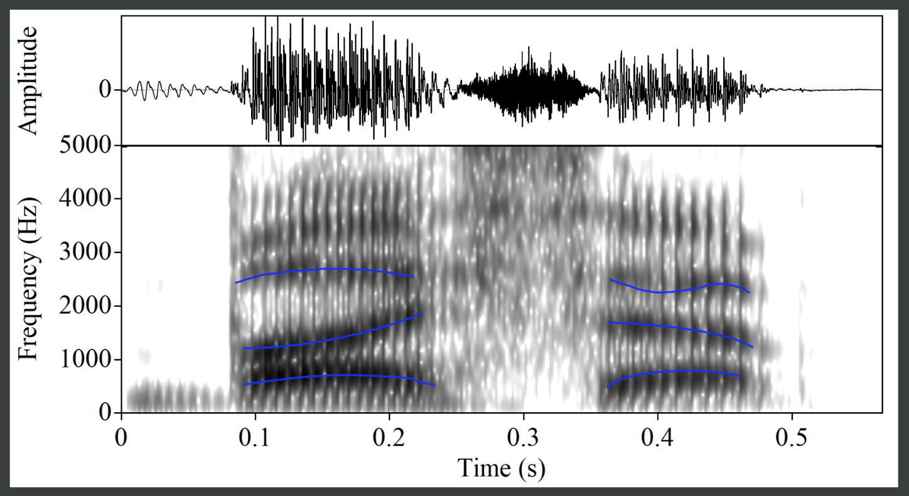

## Step 5: First Guess
{:.no_toc}
My first guess is 

```diff
+[b]
-[ɔɪ]
-[l]
![s]
-[ɚ]
```
## Step 6-?: Revision
{:.no_toc}
Wow, that is so confusing. I was really confident in my segmentation, but it looks like [s] has got to be the third segment. That means that little blip in amplitude that I thought was a velarized [ɫ] is actually just change in amplitude, and the final segment has got to be split in two. If there isn't velar pinch in the second segment, that means that shape is really just being caused by increasing F2, so I'd better keep going with diphthongs. For the final sonorant region, I'm guessing that the division happens when the glottal pulsing starts to widen. If I look at the first half, we've got mid-high F1 and mid-high F2, and it's really short and low amplitude. It could be something like an approximant, [j] or [w]? I'd want formants that look like [i] or [u], and neither pattern really fits my expectations. The second half has very high F1, and mid F2. It's also short, but maybe that's more about position and not quality.

My second guess is 

```diff
+[b]
+[aɪ]
+[s]
-[w]
-[eɪ]
```

On the right track! I am seeing in hindsight how my \<way\> syllable at the end of that guess was more based on knowledge of English and ignored the lack of evidence for those phones. A lesson in how to not be over-confident.  I'll step back here. I need two sonorants, the second of which someone is likely to creak at the end of a word. 

Sonorants:
* nasals - [m] [n] [ŋ]
* vowels
* liquids - [ɹ] [ɾ] ~~[l]~~
* other approximants - ~~[w]~~ [j]

The easiest permutations to go through are either [vowel] [consonant] or [consonant] [vowel]. I'll start with those and see if I can't think of a word

### Consonant-Vowel Permutations
{:.no_toc}
* [baɪsm-]
* [baɪsn-]
* (ŋ phonotactically impossible)
* [baɪsɹ-]
* (ɾ phonotactically impossible)
* [baɪsj-]

### Vowel-Consonant Permutations
{:.no_toc}
* [baɪs-m]
* [baɪs-n] - \<bison\>?
* [baɪs-ŋ]
* [baɪs-ɹ]
* (ɾ phonotactically impossible)
* (j phonotactically impossible)

My third guess is 

```diff
+[b]
+[aɪ]
+[s]
-[ə]
-[n]
```
Rats. Okay so it's a vowel-vowel permutation.

### Vowel-Vowel Permutations
{:.no_toc}
* [baɪsi-]
* [baɪsɪ-]
* [baɪsɛ-]
* [baɪsæ-]
* [baɪsa-]
* [baɪsoʊ-]
* [baɪsʊ-]
* [baɪsu-]
* [baɪsaʊ-]

I really can't think of anything, so I need to backtrack. Originally, I though this sound had a relatively high F1, and a high but decreasing F2. Since it's short I think it's a monophthong, so maybe that's [ɛ]. The only English word I can think of with that form is \<bicep\>, but where's the [p]? It could be unreleased, but I also don't see a closure. I guess I could be convinced that that little blip in the waveform is a closure., and that the line at 510 ms is a baby release.

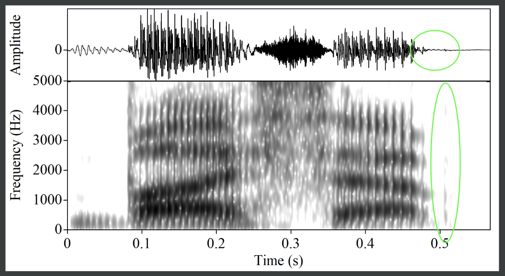

My fourth guess is 

```diff
+[b]
+[aɪ]
+[s]
+[ɛ]
+[p]
```
Woohoo!

## Step 7: Postmortem
{:.no_toc}
Again, led astray on the segmentation. I think what I learned from this day's exercise is that it's better to rely on the spectrogram and not play the lexical ``game'' part of Gramle until the very bitter end. I also learned that I need to keep in mind that visual patterns are harder to see at the end of words, where we tend to have things like low amplitude, creak, devoicing, and deletion change the visible patterns. My revisionist segmentation is below.

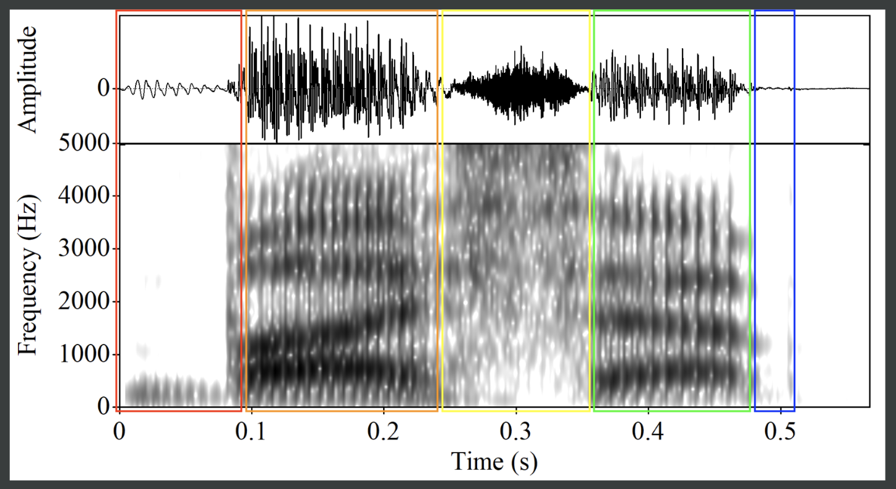

# April 9, 2025

## Original Spectrogram
{:.no_toc}
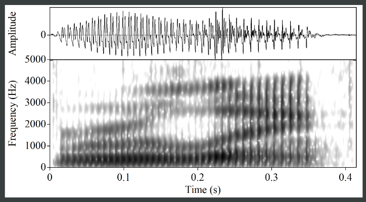

## Step 1: Segmentation
{:.no_toc}
Segmentation is really tricky for this one. We've got a very very sonorant word, where formants are clear and transition smoothly throughout almost the entirety of the word. There does seem to be a short region right at the beginning where you can see a burst-like pattern in the waveform, and a lot of whitespace in the spectrogram. The next division I'm giving in orange is based off of the zeroing between what looks like F3 and F4, which we don't see in the region in yellow. There's more zeroing between F2 and F3 in the green region, and a lower amplitude in the waveform there as well. In the blue region, we see the amplitude increase, and the zeros go away. The final phone being very long is consistent with end of word behavior, but I will stay curious about this segmentation. One thing I will keep in mind is whether the aperiodic sound after the blue region is background noise (which is my current hypothesis) or some kind of turbulent consonant, like an [h] or a fricative.

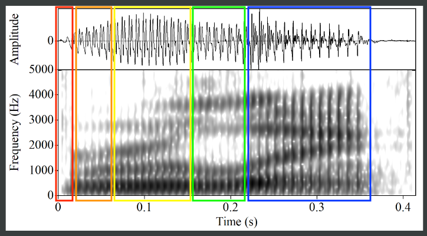


## Step 2: Voicing
{:.no_toc}
Easy. I think everything is voiced here. We can clearly see the voicing bar in the first segment, and there's no sign of it going away.

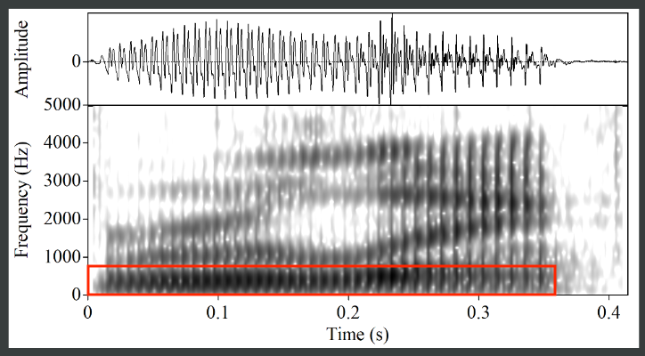

## Step 3: Manner of Articulation
{:.no_toc}
For the first segment, the short voicing bar and release shape in the waveform really make this look like a voiced stop in English. Now, for the rest of the word. With highly sonorant sounds, manner of articulation can only be a couple of things. We're looking for vowels, approximants, and nasals primarily. I think the 3rd and 5th segments are probably vowels based on their placement, amplitude, and lack of zeroing. The 5th segment I think is long enough that it could be a closed rime as well, maybe like [ɚ]. The zeros in the 2nd and 4th segment make me think that these could be nasals. It's also possible that they are approximants like [l] or [ɹ] given how vowel-like they are; I think phonotactics will be a good help for figuring that out.

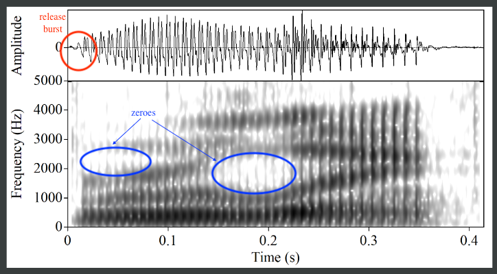

## Step 4: Formants
{:.no_toc}
The formants are tricky in this one two. Either F1 is very low, near the voicing bar, or extremely high. I think this last option is implausible based the how high the formant that starts at 1000 Hz ends up in the 5th segment. Since it goes between 800 and 2000 Hz, I think that's gotta be F2. 

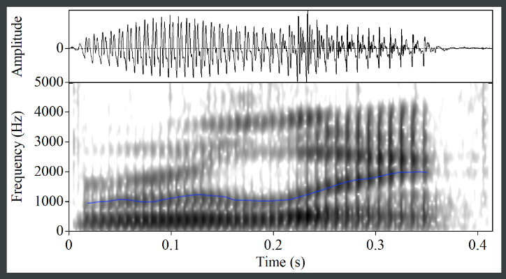

For the second segment, I don't see any strong formant patterns. F1, F2, and F3 are all very low and fairly stable. There is a little dip in F3 and a little rise in F2, but they're subtle. That makes me think that this is an alveolar sound, like [n], [l], or [ɹ]. For the fourth segment, F1, and F2 are low but F3 is quite high. There's also a dip in F2, and it's hard to see what's happening in F1. Since F2 and F3 are nowhere near each other we can rule out a velar place of articulation. I wonder in the pitch in F3 is being caused by [l] here, which can have zeros but also I've noticed can have weird qualities in the higher formants.

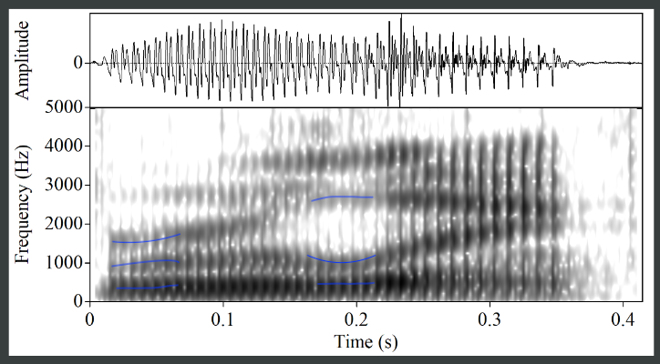

For the segments I'm calling vowels, our first vowel has a low F1 and F2 and is pretty short. I think we're looking at a monophthong, in the top right of the vowel space. For the second vowel, F1 is a little higher, and F2 makes a transition for the lower third of its frequency range up towards F3. F3 also seems like it's taking a subtle drop. This could mean it's a diphthong that gets fronter, like [aɪ] and [ɔɪ], but those I would expect to have higher F1s that get lower.

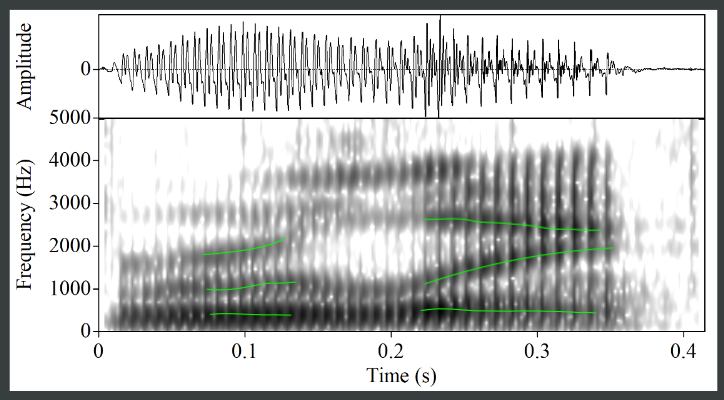

## Step 5: First Guess
{:.no_toc}
I'm gonna be brave and try a real word for my first try

My first guesses are: 
```diff
- [b]
! [l]
! [u]
- [m]
- [ɚ]
```
## Step 6-?: Revision
{:.no_toc}
The placement issue on my first guess makes me think my segmentation may have been off. What if there esn't really a stop segment at the beginning? The only other options are [d] and [g]. Since it's short and probably next to an approximant, I think [g] is more likely (I think [d] would induce some frication that I don't see). I can also almost be convinced of velar pinch between F2 and F3. I'm guessing that the [l] is that central segment with the zeros between F2 and F3 now. But is it the third or fourth segment? I'll stick with my segmentation for my second guess, but the placement of [u] at the end of a word is pretty phonotactically weird.

My second guess is:
```diff
- [g]
! [ɹ]
- [ə]
! [l]
! [u]
```

Ugh. Okay. That [l] has gotta be the center segment, so it's going third this time. For the rest, I'm feeling very pessimistic about the segmentation What if the rime at the end has a nasal instead of a rhotic? [ŋ] could explain why F2 and F3 are so close at the end, and the [ɪ] vowel would explain the increase in F2. I'll just put the rest of the known segments in a phonotactically plausible position and see what happens.

My third guess is

```diff
+ [ɹ]
+ [u]
+ [l]
+ [ɪ]
+ [ŋ]
```

Woohoo!

## Step 7: Postmortem
{:.no_toc}
I really let myself get led astray by a bad segmentation, really caused by putting too much faith in a little bit of prevoicing. And then got excited by the chance that I might be able to guess a word straightaway. In hindsight, the formant transition for the \<ing\> portion of the word are really clear: Low F1, increasing F2, and a close F2 and F3 by the end. With the new segmentation in mind (and that pesky hindsight), it's a lot easier to see what's going on.

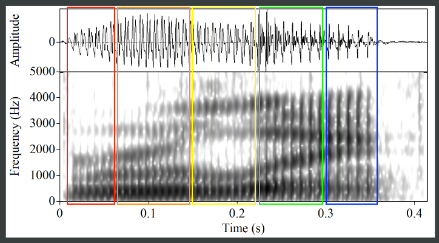


# April 8, 2025

## Step 1: Segmentation
{:.no_toc}
At first pass, the segmentation for this gramle seems pretty straightforward. 
In the first region (red) we see aperiodic sound, evenly distributed acros the visible frequencies, with no strong formants.
In the second region (orange) we see strong formants, very periodic waveform, with a transitory F2.
From the second to the third region (yellow), there is a noticible dropoff in overall intensity (much lighter spectrogram). The formants are still visible but are much lighter.
The intensity of the waveform picks back up in the fourth region (green) and we can see regular formant patterns, but this is a quieter sound than the second region.
The last region (blue) has a two-pattern temporal sequence. First, there's what looks to be a complete closure. Then we see a release of that closure into aperiodic sound.
While this has two specific patterns in the spectrogram, it is still consisten with a single phone. We'll see this next.

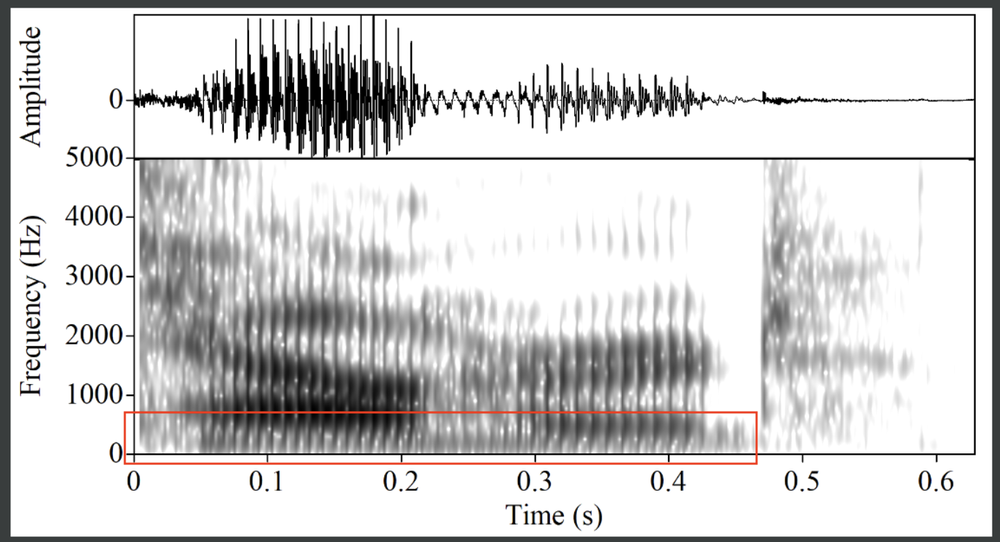

## Step 2: Manner of Articulation
{:.no_toc}
My guesses and rationale for the manners of articulation for each segment are as follows

* R1: Fricative or aspirated stop
  * aperiodic
  * at the beginning of the word (sometimes a release burst is hard to see at the beginning of a recording)
  * low amplitude
* R2: Stressed vowel
  * high amplitude
  * strong formants
  * long
* R3: Nasals
  * Lower amplitude
  * Visible, but faint formants
* R4: Unstressed vowel
  * medium amplitude
  * strong formants
  * longer than the consonants but not as long as the other vowel
* R5: Stop
  * Very low amplitude region (closure) followed by a sharp line (release burst) and aperiodic noise (aspiration)
 
## Step 3: Voicing
{:.no_toc}
To check for voicing on each segment, I am looking for a voice bar in the bottom of the spectrogram at a reasonable frequency for this speaker. The recordings for gramle come from the MALD database (Tucker et al. 2019), which are made by an adult Canadian male. It looks like theres consistent voicing throughout the entirety of the word up until the final release. Before 50 ms, it's hard to tell whether there's actually voicing or if it's just aperiodic noise in all frequencies including and overlapping with voicing frequencies. For now, I'll say that everything is voiced except maybe the first segment.


## Step 4: Formants
{:.no_toc}
We should consider the formant ranges that ought to be associated to different vowel qualities, within the context of adult Canadian male speech. Formants will also be helpful in figuring out the place of articulation of the consonants.

For the first vowel, it looks like F1 is around 600-800 Hz, which is quite high. So I suspect this is a low vowwel. F2 goes from about 1800 Hz to 1200 Hz, really spanning the range for this speaker. This may mean it's a diphthong that goes from a front nucleus to a back offglide. The other option is that this quality is influenced by the sounds around it. If we look at F3, I can see something that looks like velar pinch between F2 and F3, though it's subtle. This could mean that the sound that comes before this vowel is velar, like a [k].

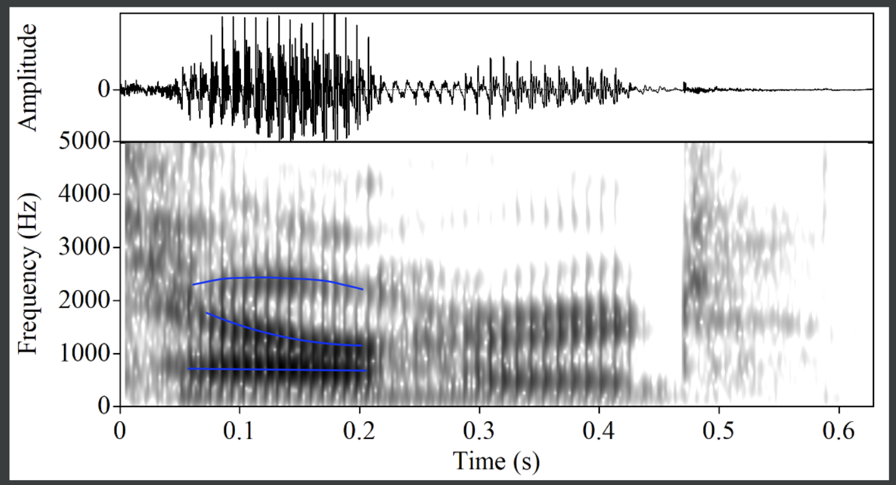

The formants of the nasal are pretty boring. They transition smoothly between the vowels. If we were dealing with a bilabial nasal [m], I would expect all the the formants to dip down towards the nasal. For the velar nasal [ŋ], I'd wanna see velar pinch. And I don't see either of these.


The formants of the unstressed vowel show a little bit of transition on either end, but are pretty horizontal. It looks like F1 is keeping around 500 Hz, and F2 is around 1500 Hz. I think for this speaker those are both middle of the pack ranges. The is a little scoop of F2 right at the end, which again may point to the sound after this vowel being velar.

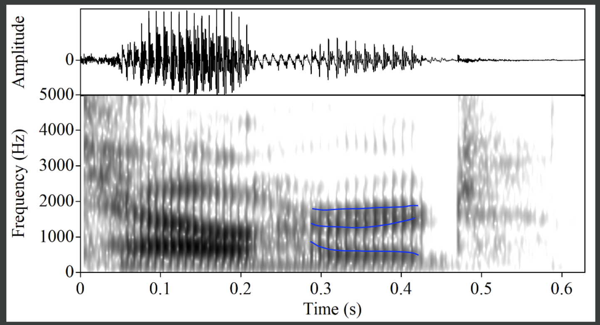

## Step 5: First guess
{:.no_toc}
My first guesses are: 
```diff
+ [k]
- [a]
- [n]
- [ə]
- [g]
```
## Step 6-?: Revision
{:.no_toc}
Okay so I only got the first segment [k] right. That tells me I was right about the formant movement in the first vowel being due to transition. I'm still loking for a low vowel, but not [a]. It is pretty long, so might be a flatter diphthong like [ɑʊ] or [oʊ]. I still feel like the segment in between the vowels is a nasal; the amplitude is too low for a vowel and it's too formant-y for most consonants. I guess it could be an approximant, but then I think the amplitude is still too low. For the unstressed vowel, I think I'll revise given that the final segment isn't [g], and treat F2 like it's highter (for a fronter sound). For the last stop, on second look there's a lot of aspiration for a voiced stop. Maybe that voicing bar is just bleed-over from the vowel. I'm going [t], because I don't see dips down for a bilabial transition like I'd expect for [p].

My second guess is: 

```diff
+ [k]
- [oʊ]
- [m]
- [ɪ]
- [t]
```

Wow, didn't do any better. I guess I'm giving up on this nasal idea, because there's still no sign of velarization. I'll move to an approximant [l] and try similar qualities for the vowels. I'll also soften my assumptions for the final segment, though I'm very sure it's a stop.

The third guess is: 
```diff
+ [k]
+ [ɑʊ]
- [l]
- [ɛ]
- [p]
```

Getting closer, but I still don't have many guesses left. I need to change strategies. Looking back on my original assumptions, I thought the third segment was nasal because it was light and had formants. There's one other segment that does that in English: [h]. For the final segment, it really does look like voicing in the closure, I don't know why I was so quick to discount that. I'll go back and guess [d] since I still don't see bilabial transitions in the formants. The only English word that has those segments in that order is "cowherd." I like that because it agrees with my older belief that the unstressed vowel is centralized.

My fourth guess is 

```diff
+ [k]
+ [ɑʊ]
+ [h]
+ [ɚ]
+ [d]
```

Woohoo!

## Step 7: Postmorterm
{:.no_toc}
Why didn't I see the schwar in the fourth segment? Well, for rhoticity I would want to look at F3. But F3 isn't really doing anything interesting in this segment. I think it's too short to see the wiggly pattern I associate with rhotics on F3.
