# About
{:.no_toc}
This blog archives my performance on [gramle](https://nascl.rc.nau.edu/gramle/), a Wordle-style spectrogram game. The goal of this blog is to help phonetics students and fellow gramle lovers see one phonetician's thought process.

<video controls="" autoplay="" name="media">
    <source src="https://sarablalockng.github.io/teaching/gramle-time.mp3" type="audio/mp3">
</video>

# Date Navigation
{:.no_toc}

* Placeholder for Table of Content (Must not be removed)
{:toc levels="1"}

## Archive of Previous Months
{:.no_toc}
[April 2025](./gramle-archive/april25.md)

# May 23, 2025

## Original Spectrogram
{:.no_toc}
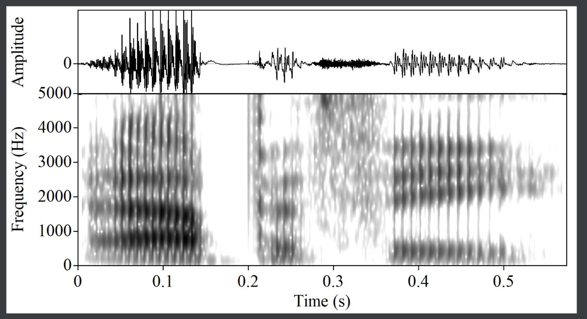

## Graphics
{:.no_toc}

### Segmentation
{:.no_toc}
There are two options for the segmentation. 
1) The low amplitude region at the very beginning is an onset to the first syllable. This requires that the sonorance at 225 ms be part of aspiration of the stop before. This could be cause by something like an epenthetic schwa, but would be rarer
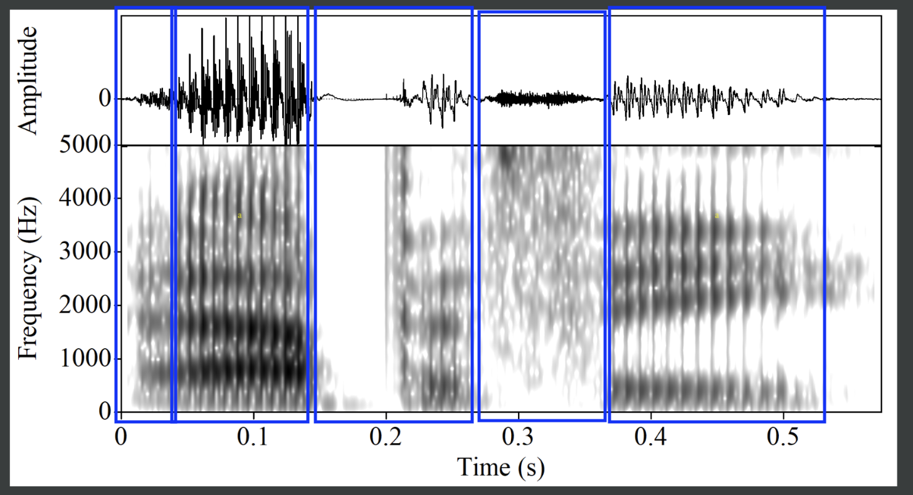

2) There is not onset to the first syllable. The sound between 225-275 ms is it's own segment. I'll go with this because I think it makes more sense phonotactically and I think the start before 50 ms is probably something like laryngealization at the start of a word-initial vowel.
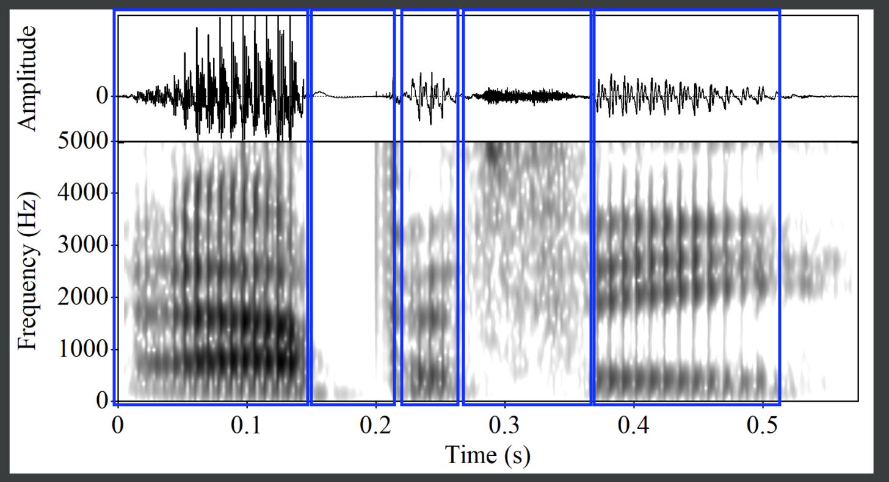

### Voicing
{:.no_toc}
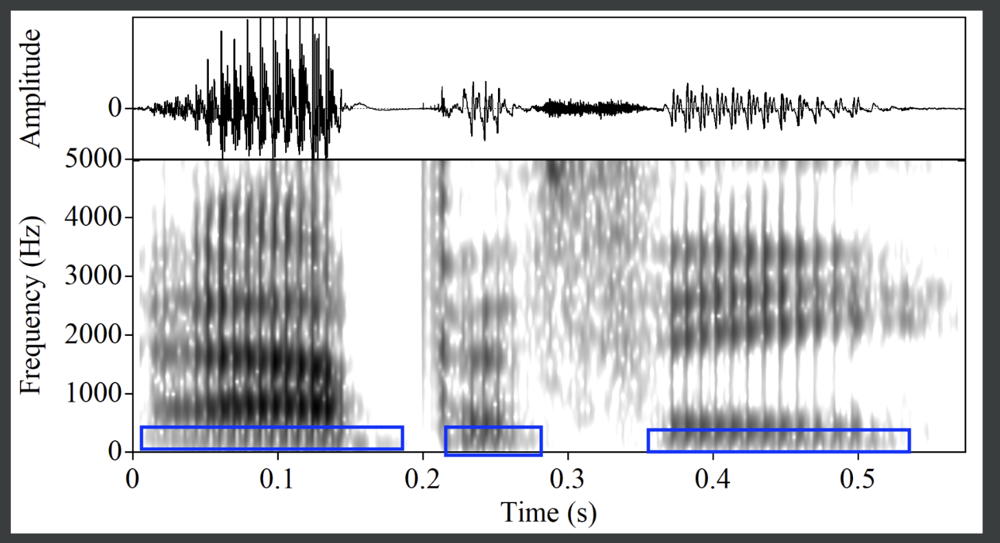

### Formants
{:.no_toc}

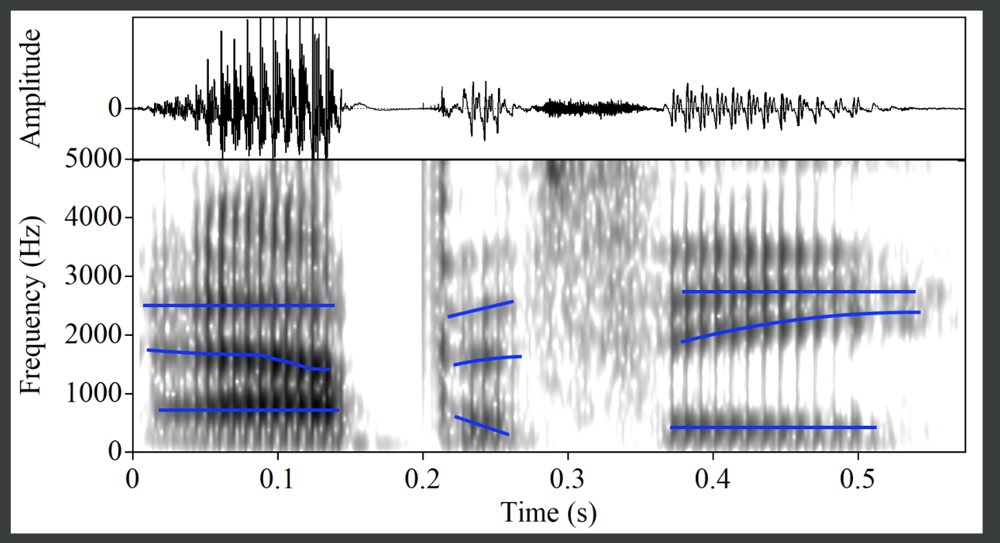

## First Guess
{:.no_toc}

* **Segment 1**: High amplitude, visible formants, no zeros = stressed vowel. F1 is high and F2 starts high and dips towards the middle. I'm thinking a low front vowel
* **Segment 2**: Clear closure and release burst, with short VOT. It looks like the formants consistently dip towards the closure, which makes me think this is bilabial, either [p,b]. The voicing and VOT intervocalically between those two are pretty similar.
* **Segment 3**: A very short segment with high F2 and middle F1. I think this is a reduced vowel. [ɪ] makes the most sense based on formants but I bet phonemically it would be [ə] based on how this speaker tends to use high reduced vowels.
* **Segment 4**: Frication noise. Looks like it is more concentrated toward the high-end but with no obvious center. No voicing. My first guess for this is going to be a little unorthodox for the frication shape, but I wanna start with a word.
* **Segment 5**: Sonorant with low F1 and very high F2 = [i]

My first guess is
```diff
+æ
+p
+ə
+θ
+i
```

YEEHAW!

# May 22, 2025

## Original Spectrogram
{:.no_toc}
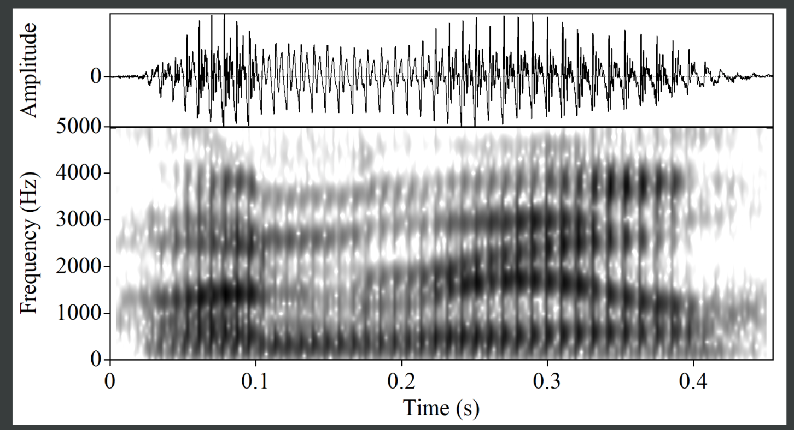

## Graphics
{:.no_toc}
### Segmentation
{:.no_toc}
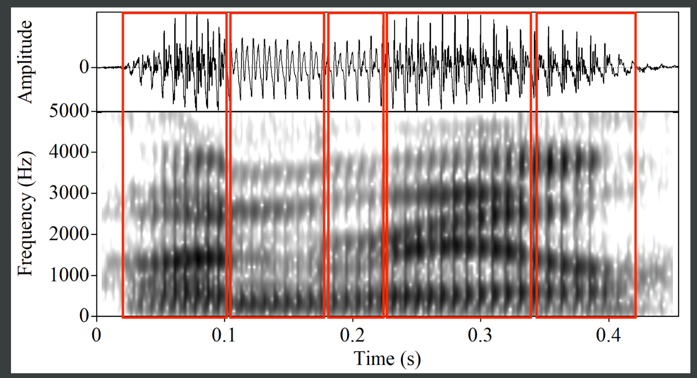

### Voicing
{:.no_toc}
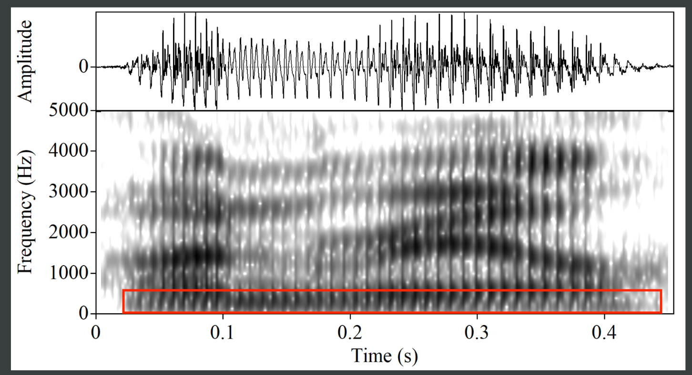

### Formants
{:.no_toc}

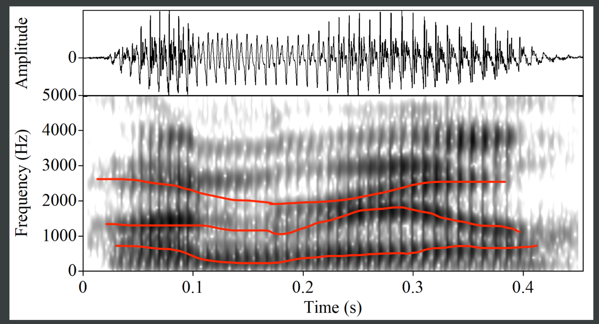

## First Guess
{:.no_toc}

All of these segments are voiced sonorants. The first, fourth, and fifth look more like vowels or approximants, and the 2nd and 3rd look like nasals. The formants of the second are lower than the third, so I think the 2nd is an [m] and the 3rd is either [n] or [ŋ]. The first segment has high F1 and low F2, and looks unstressed, so I'll start with [a]. For the 4th segment, F1 is mid and F2 is mid-high, and it's louder than the 5th so I think it's a vowel + approximant rime. Between [w, l, ɹ] for the coda I think [ɹ] is more likely. 

My first guess is 
```diff
-a
-m
!n
-ɛ
!ɹ
```

I am feeling down about my performance lately.
## Revision
{:.no_toc}

Well I'll shift all the known approximants to the left. For the 5th segment, the dip down in F2 could be caused by an [l]. I was hoping to see velarization if that were the case, but maybe this is citation speech without velarization. The word I'm thinking of based on that is \<unreal\>. The [i] would get centralized before [l] which explains the formants, and schwa would also work for the unstressed vowel.

My second guess is 
```diff
+ə
+n
+ɹ
+i
+l
```

Feeling better.
## Postmortem
{:.no_toc}

# May 21, 2025

## Original Spectrogram
{:.no_toc}
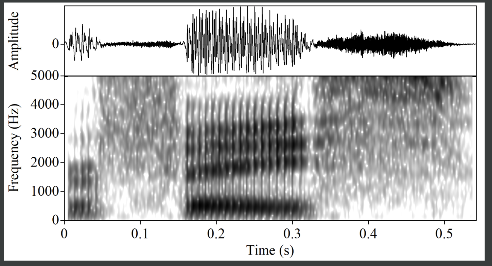

## Graphics
{:.no_toc}

### Segmentation
{:.no_toc}
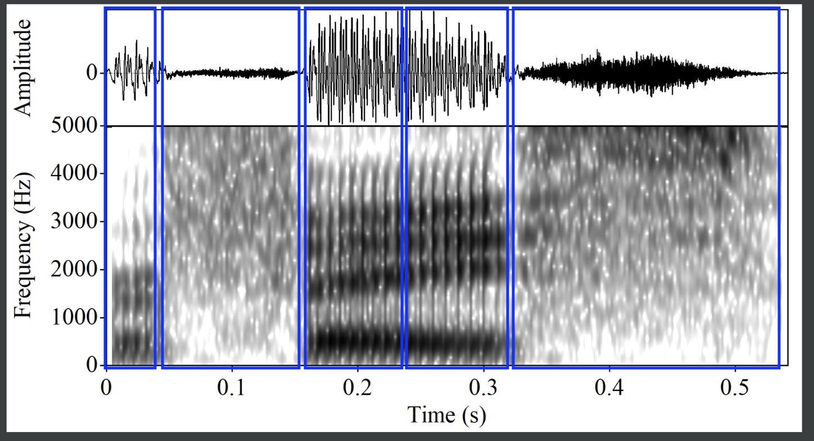

### Voicing
{:.no_toc}


### Formants
{:.no_toc}

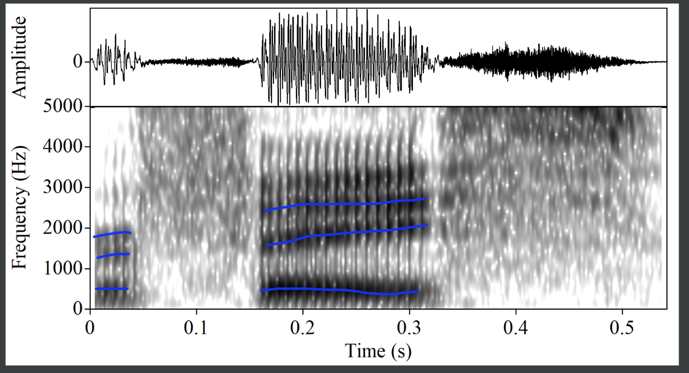

## First Guess
{:.no_toc}

* **Segment 1**: A short, sonorant segment with middling amplitude. This looks like an unstressedd vowel. F1 is mid and F2 is fairly low, so maybe I'll start with schwa.
* **Segment 2**: This looks like a fricative, with low amplitude, no formants, and not a strong sign of something like a release burst at the beginning. There's no strong center of energy in the high frequencies, so maybe less likely that it's a sibilant. I can almost be convinced that the formants are dipping down in the following segment, so maybe it's more anterior. The lack of voicing means the candidates are [f, θ].
* **Segment 3**: This looks like the stressed syllable, with clear formants high amplitude and lack of zeros. F1 is mid and F2 starts central and ends high. That could mean a diphthong, or something like [ɛ] that can plan like a diphthong in this variety of English in some phonotactic positions.
* **Segment 4**: This looks like either a nasal or an approximant. The amplitude is high, making me think that approximant is more likely. So then thinking about [w,l,j,ɹ]. We can rule out [j] based on syllable position. For [w, l] I would expect formant dipping, which I don't see. But a nasal would make a word...
* **Segment 5**: This looks like a loud sibilant. It's so loud I double and triple checked to see if there was a closure for an affricate... The center of energy is high around 5000 Hz. There's no voicing bar but that could be because of word-final devoicing. The loudness is tripping me up.

I'm being brave and starting with a word.

My first guess is
```diff
-ə
!f
-ɛ
-n
+s
```
Wow that was not great.
## Revision
{:.no_toc}

I don't believe that there's two segments before the first fricative, so that must mean theres and \<fs\> cluster at the end of the word. That means that the big sonorant segment is one long syllable. I'm going to go with the diphthong version of what I already had. For the first vowel, I need something short in the back of the vowel space. Maybe it's a monophthongy [oʊ]. For the second vowel I want something with the high vowel [ɪ] as the offglide, and I think [aɪ] makes the most sense before [f].

My second guess is
```diff
-oʊ
-θ
-aɪ
!f
+s
```

Excuse me? So there are two segments before the [f] after all. There's really not room for a sonorant, so I bet it's a voiced stop at the very beginning with a very short lag VOT. So thinking about [b, d, g]. The only word I can think of is \<deface\>.


My third guess is
```diff
-d
+i
+f
+eɪ
+s
```

This is very frustrating to me. I truly do not see any other word. Is \<reface\> a word?

My fourth guess is
```diff
+ɹ
+i
+f
+eɪ
+s
```

## Postmortem
{:.no_toc}

I don't believe this is a word. In listening to it, that first syllable is super duper reduced, which made it hard to see that it could be multiple sonorants.

<audio controls>
  <source src="https://nascl.rc.nau.edu/MALD/REFACE.wav" type="audio/wav">
  Your browser does not support the audio element.
</audio>

# May 20, 2025

## Original Spectrogram
{:.no_toc}
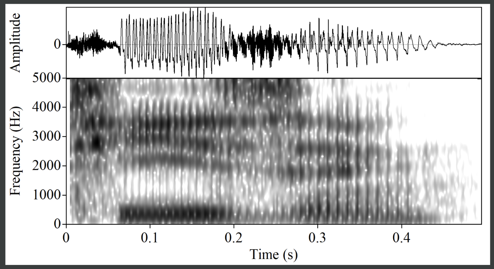

## Graphics
{:.no_toc}

### Segmentation
{:.no_toc}
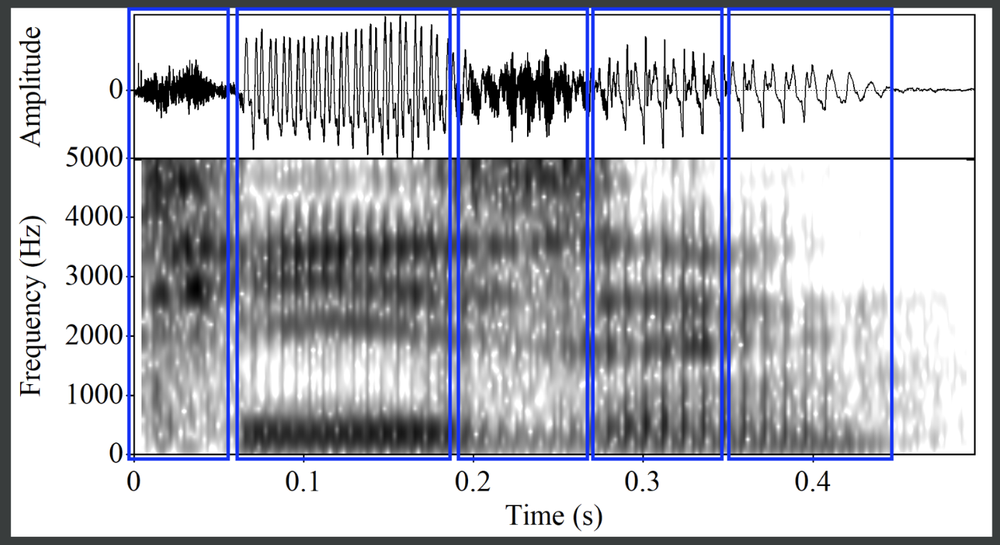

### Voicing
{:.no_toc}
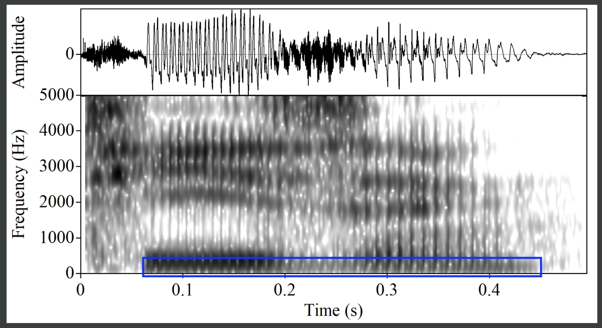

### Manner
{:.no_toc}
The waveform of those sibilants looks so cool I wanted to highlight it. There's a LOT of turbulence and a very wide half-cycle shape.
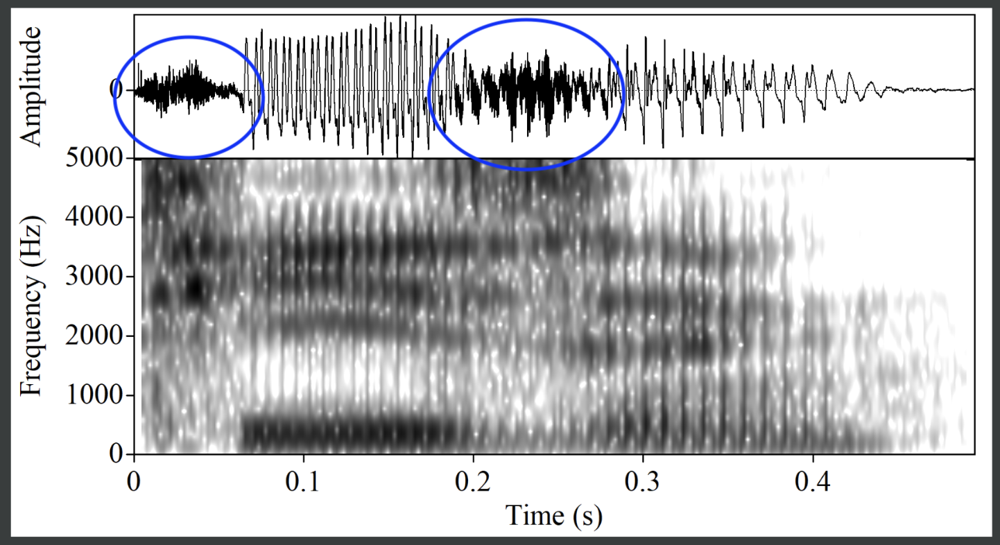

### Formants
{:.no_toc}
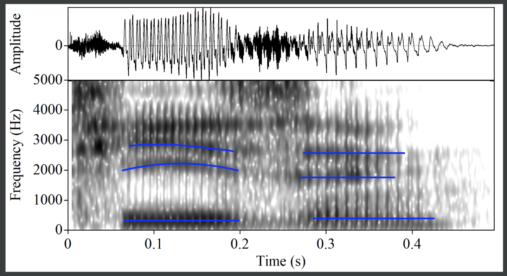

## First Guess
{:.no_toc}

* **Segment 1**: A sibilant shape with the classic frequency smear, lack of voicing, and center between 3-5000 Hz. That makes me think about [ʃ], but also at the very beginning of the waveform it looks like there's a release burst. I'm going to start with the affricate [tʃ].
* **Segment 2**: This segment looks weird because the waveform is relatively simple (pattern almost looks like a sine wave). In addition, F2 is crazy high, making me think that [i] is the only reasonable vowel quality. The amplitude looks appropriate for a stressed vowel, which supports this hypothesis. The space in between F1 and F2 is so light that I'm almost curious about whether this segment is nasalized. Maybe there's vowel nasalization and I'm missing a segment before the next sibilant...
* **Segment 3**: A loud sibilant with frequency center around 5000 Hz and a voicing bar.
* **Segment 4**: A creaky unstressed vowel (based on long irregular pulses), with a still very high F2 and low F1. Based on stress I'm going to say [ɪ], but if that's wrong I'll say [i].
* **Segment 5**: The amplitude is dying off, as is the sonorance. Formants are shadowy, making me think about non-sibilant fricatives. It's voiced, with no clear formant transitions. The options are [v, ð]. The more probably option is [v], so I'll start with that.

My first guess is
```diff
-tʃ
+i
+z
+ɪ
-v
```
Hmm.
## Revision
{:.no_toc}

Since the affricate didn't work for the first segment, I have three options: 1) it's not really an affricate and is a sibilant. Starting with \<sh\> doesn't make sense with the correct responses, so then I would be thinking about [s] instead. 2) It's a voiced affricate and the voicing is just unclear. I also don't think there's any words that fit that criteria. That puts me stuck with [s]. The words that will fit then are \<seizing\> and \<seizes\>. The fifth segment really does not look like a sibilant, so the former is what I'll go with.

My second guess is
```diff
-s
+i
+z
+ɪ
+ŋ
```

Huh? Okay I was confident but I need a serious backtrack. Maybe I shouldn't have convinced myself away from the release burst at the beginning, and this is aspiration. That is consistent with the funky shape of the waveform, the release burst, and the lack of a visible voicing bar.

My third guess is
```diff
+t
+i
+z
+ɪ
+ŋ
```

## Postmortem
{:.no_toc}

I don't know how many days I'm going to gramle and make the same mistakes. I think part of the general challenge of reading spectrograms is to know what unusual phenomena are ignorable versus which ones are really indicative of the categorical quality of the sound.

# May 19, 2025

## Original Spectrogram
{:.no_toc}
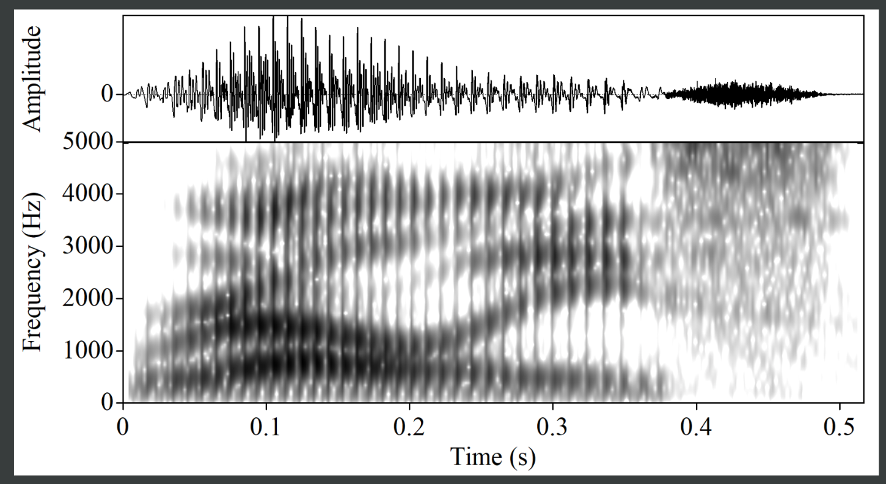

## Graphics
{:.no_toc}
### Segmentation
{:.no_toc}

The segmentation here is obviously very difficult thanks to the sonorance. There are big changes in the formants, but they don't all line up to the same points of time. I'm combining formant info with trends in the amplitude as seen in the waveform.
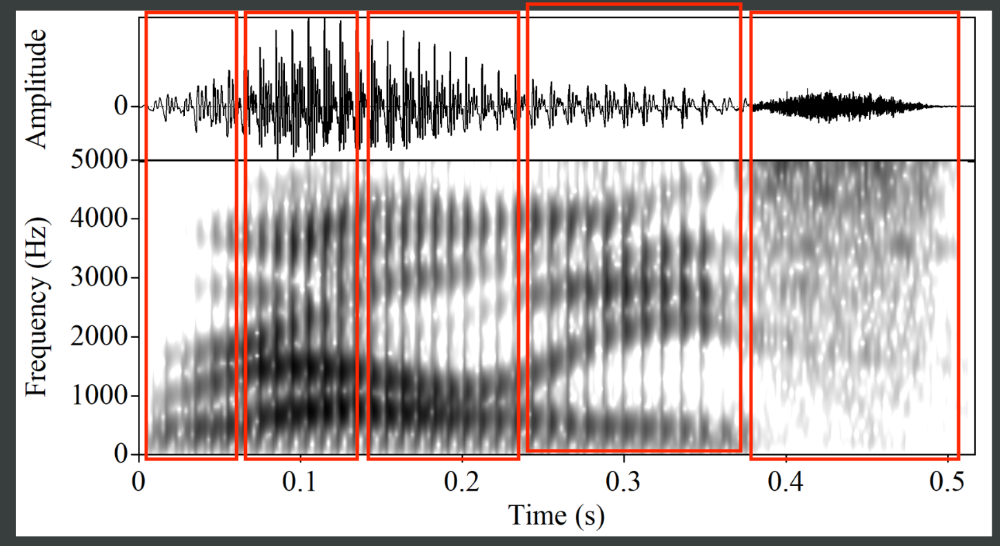

### Voicing
{:.no_toc}
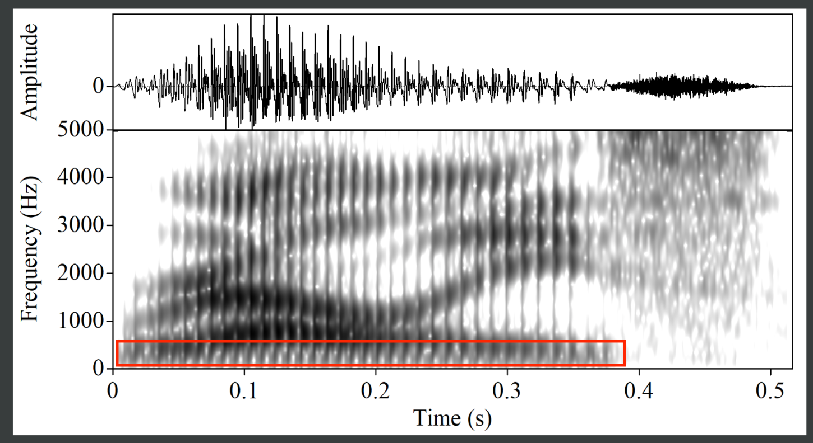

### Formants
{:.no_toc}
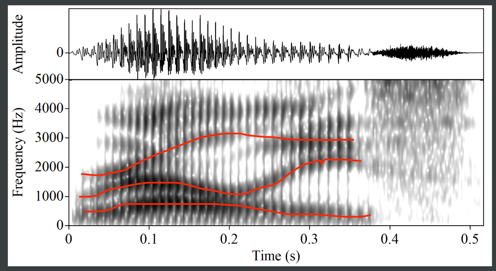

## Step 5: First Guess
{:.no_toc}

* **Segment 1**: Sonorant consonant based on amplitude and position. Formants curl down, so maybe [w] or [m].
* **Segment 2**: High amplitude segment, the stressed vowel. F1 is mid and F2 is low. Maybe [oʊ] based on the movement of F2.
* **Segment 3**: Looks like it shoudl be an approximant, but phonotactically that's weird. If my guess on S4 is wrong, then [l] is possible which matches the dip in F2.
* **Segment 4**: Low amplitude, formants, zeros. F2 and F3 are close, so maybe this is the velar nasal. Or, this is a very quiet front vowel?
* **Segment 5**: This looks like a classic [s], but since the previous segment is voiced I'm going to say that it's a devoiced /z/.

My first guess is 
```diff
-w
-oʊ
+l
-ŋ
+z
```

Okay not good but not bad.

## Step 6-?: Revision
{:.no_toc}

Now that I know my S4 was wrong I'm going to say that that's an [m] based on the context. There are a few words that end in [almz], but none that start with a sonorant. Maybe there's a weird voiced stop? I can't see a release but I'll try.

My second guess is 
```diff
-b
-a
+l
-m
+z
```

Ah, there's another approximant that can go in S4:  a rhotic. I'll go back to a reasonable approximant and back vowel for S1 and S2:
```diff
+ɹ
-u
+l
-ɚ
+z
```

Uh oh, not doing great. Using my word class generator again, I got these candidates:

* RALLIES
* RELIES
* RELAYS

The second word has the stress in the wrong position, so it's out. The F1 is a little low for [i], so I'm going to go with the first option.

My fourth guess is 
```diff
+ɹ
+æ
+l
+i
+z
```

Finally.

## Step 7: Postmortem
{:.no_toc}

The [i] vowel was the most confusing part to me, since the amplitude is so low.

# May 16, 2025

## Original Spectrogram
{:.no_toc}
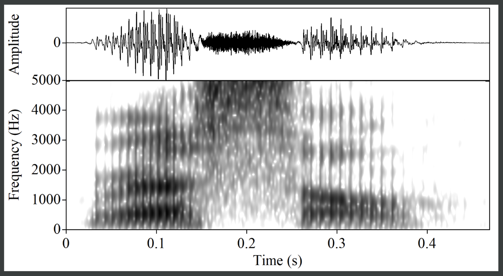

## Graphics
{:.no_toc}

### Segmentation
{:.no_toc}

The segmentation here is a little hard to see, but I think it's atually much easier to see on the waveform than on the spectrogram. I'm looking at the big changes in the shape of the waveform, and in the changes in amplitude.
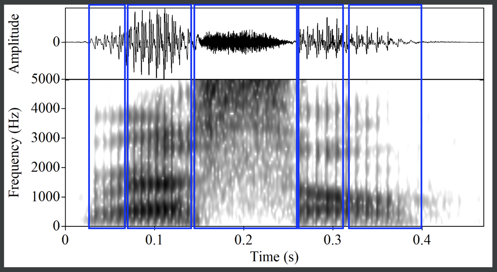

### Voicing
{:.no_toc}
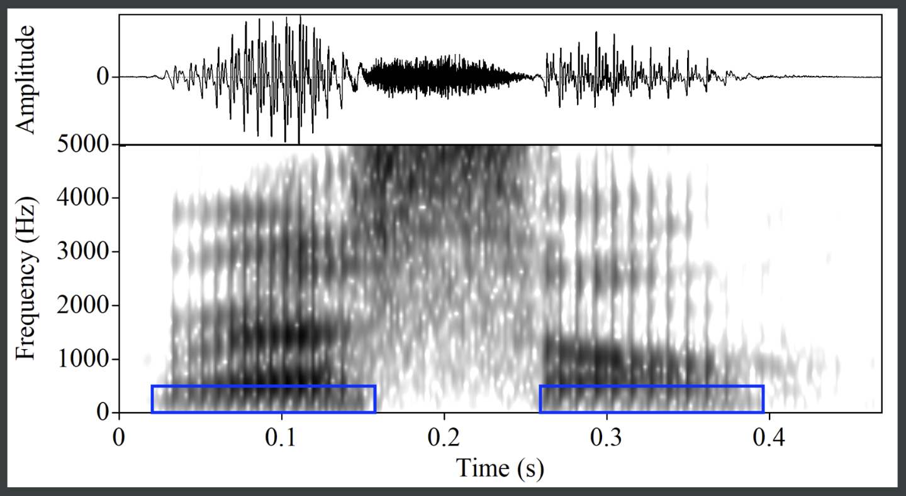

### Formants
{:.no_toc}

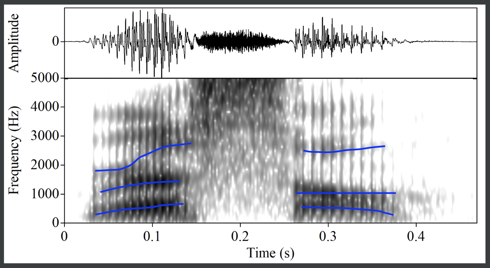

## First Guess
{:.no_toc}

* **Segment 1**: Strong formants, low amplitude, zeros. Either an approximant or a nasal. F2 dips down and the higher order formants are very light. That makes me think that the candidates should be [m, w, l]. 
* **Segment 2**: Strong formants, high amplitue, long segment. This is our stressed vowel. F1 is mid and F2 is lower mid, so thinking about a central vowel or something in the (high) back of the vowel space. It's pretty short for a stressed vowel, so maybe a little less peripheral? 
* **Segment 3**: This looks very much like an [s] to me. It's got a concentration of energy around 5000 Hz, no voicing bar, and no formants. The little blip right at the beginning of the waveform makes me a little concerned about whether it might be an affricate, but that may be a little air bubble from the transition from segment 2.
* **Segment 4**: This looks like an unstressed vowel. F1 is high and F2 is very low, so maybe a low back vowel. There's not a ton of unstressed options down there, so I'm also curious how much formant transition is playing with these vowels; could it be schwa?
* **Segment 5**: Formants are light with a general low amplitude and big zeros. The F1 and F2 are dipping down as well. I'm thinking that this could be [m], but I'm not sure becaues it is really light and that's giving me pause.
My first guess is
```diff
!l
-ʌ
+s
+ə
-m
```
Not the best, not the worst.
## Revision
{:.no_toc}

Now I know that the final segment is [l]. It's almost time for class so I'm going to cheat and use my [word generator](https://sarablalockng.github.io/research/elicitations/make_wc.html) to help me find things that start with an approximant or nasal with this frame. That gives me the list:
* WRESTLE
* WHISTLE
* NESTLE

Of those, I like [ɛ] as a vowel better since it should have a lightly lower F2. So I just need to pick where I think [ɹ] or [n] is the more likely onset... The movement of the formants makes me ever so slightly think that [ɹ] is better.

My second guess is
```diff
+ɹ
+ɛ
+s
+ə
+l
```

Woohoo!
## Postmortem
{:.no_toc}
Thinking about formant transitions and segmenting using the waveform were the big 'wins' of the day.


# May 15, 2025

## Original Spectrogram
{:.no_toc}


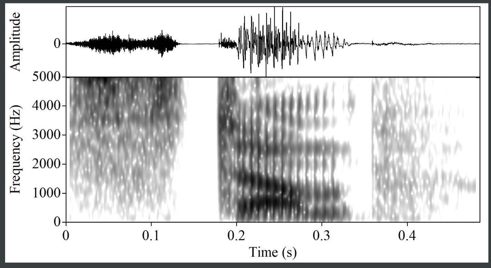

## Graphics
{:.no_toc}

### Segmentation
{:.no_toc}
The segmentation here is so clear, I think this would be a good one to learn from for a beginner.
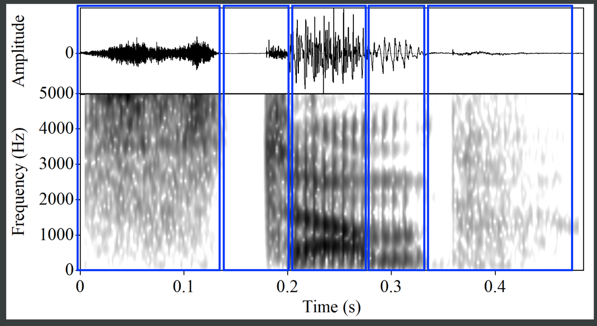

### Voicing
{:.no_toc}
Only the third and fourth segment have a voicing bar.
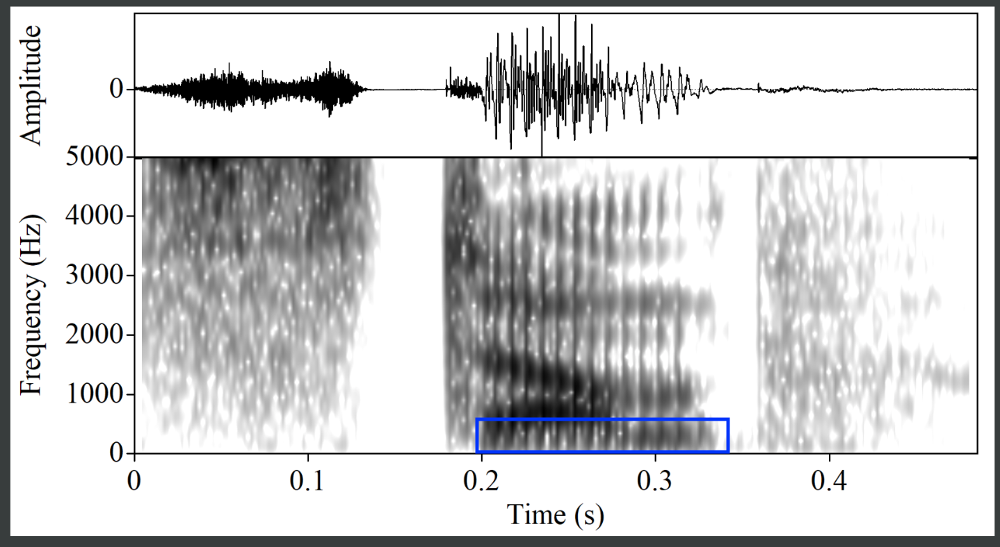

### Formants
{:.no_toc}

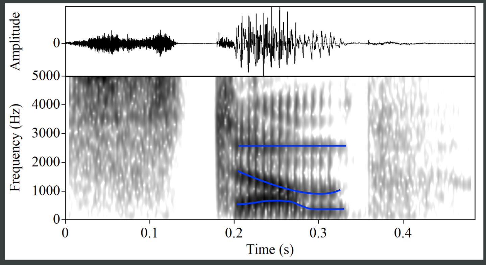

## First Guess
{:.no_toc}

* **Segment 1**: A clear fricative smear with center of energy at 5000 Hz, and no voicing bar. Gotta be [s].
* **Segment 2**: A really silent stop and clear release burse and aspiration. This is going to be a voiceless stop. F2 creeps up towards the release, which may be evidence of a velar closure.
* **Segment 3**: F1 is fairly high and increasing, while F2 drops over the course. High amplitude and strong formants makes this a stressed vowel. I'm not sure about the vowel quality, and worried that formant transitions are in the way. I'm going to pick the vowel based on what my other guesses are.
* **Segment 4**: Zeroing and lighter formants make this likely to be a nasal or approximant, and the syllable position says that it's a nasal. No evidence of bilabial downturn or velar pinch (that I can see), so hopefully it's an [n].
* **Segment 5**: The shape of closure and aspiration says voiceless stop, but since this follows a sonorant I think this is probably a devoiced phonemically voiced stop. I don't see formant transitions that would indicate place, but phonotactically [d] is the most likely option.

My first guess is
```diff
+s
-k
-æ
+m
-d
```
Rats, that's not great.
## Revision
{:.no_toc}

Maybe this is the once in a blue moon that a final segment is not devoiced; there are a lot of words in English that end in [mp]... Given that coda, I think [st] is the most likely onset. So then the big question is about the vowel quality. There are few words that fit the bill:

* stamp
* stump
* stomp

We know it's not stamp, and between stump and stomp I think stump makes more sense with the F2 we're seeing.

My second guess is
```diff
+s
+t
+ʌ
+m
+p
```

Wooohoo!

## Postmortem
{:.no_toc}

I think I was too much of a smart aleck on this one, ignoring acoustic cues for things I think were phonologically likely.

# May 14, 2025

It's another rapid fire, just the guesses today.
## Original Spectrogram
{:.no_toc}
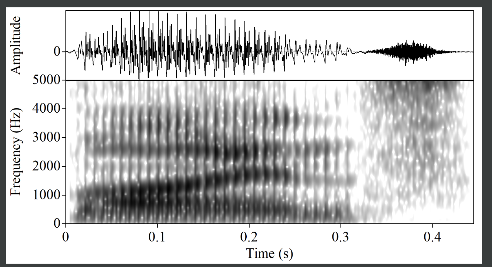

## Graphics
{:.no_toc}

### Segmentation
{:.no_toc}
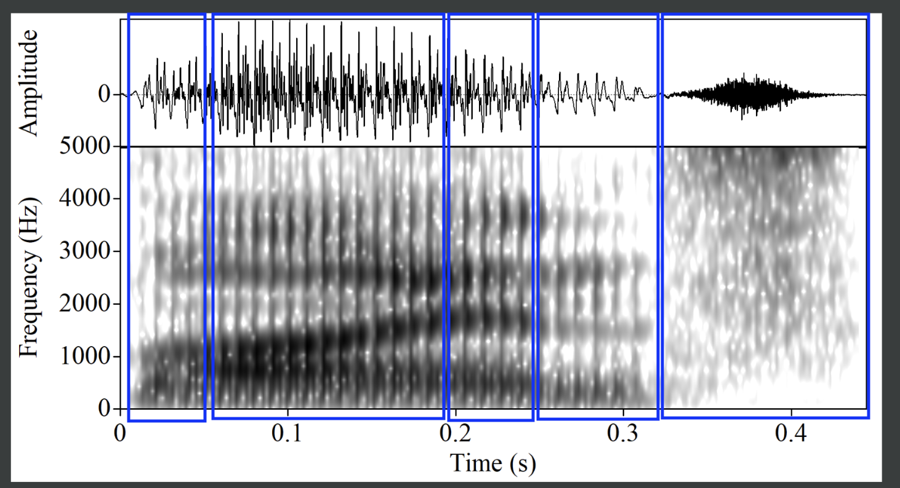

### Voicing
{:.no_toc}
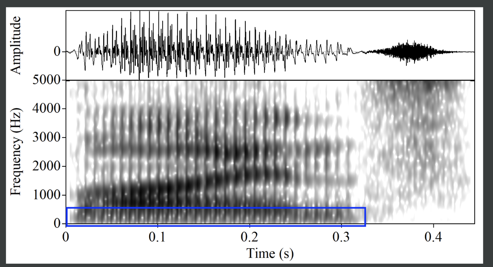

### Formants
{:.no_toc}

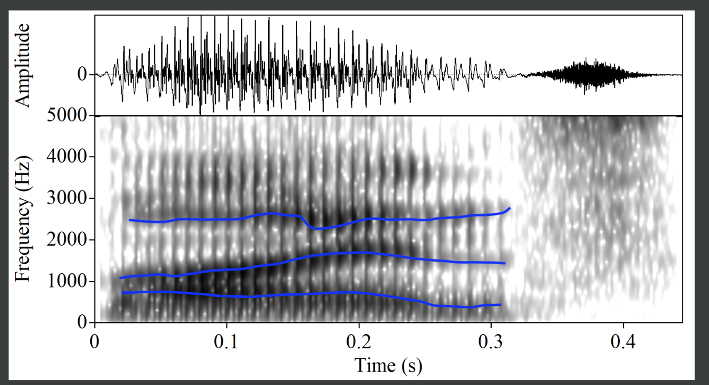

## First Guess
{:.no_toc}

* **Segment 1**: Short sonorant segment with some zeroing and irrebular glottal pulsing, lowered F2.
* **Segment 2**: Low increasing F2, fairly high F1, stressed vowel
* **Segment 3**: High F2, mid F2 vowel or approximant
* **Segment 4**: Nasal zeros
* **Segment 5**: I think this is a /z/ that is getting devoiced since it follows a voiced segment and is at the end of the word

My first guess is
```diff
+m
+aɪ
-ɹ
!n
+z
```
Pretty close!
## Revision
{:.no_toc}

I think I've switched the order of the rhotic and the second nasal.
My second guess is
```diff
+m
+aɪ
+n
-ɚ
+z
```
Excuse me? I was so confident about that. I guess it could be \<minds\>, but I don't see a stop release anywhere here.
My third guess is
```diff
+m
+aɪ
+n
+d
+z
```
Annoying.

# May 13, 2025
Today is going to be another rapid fire because I've got a deadline I need to mind.
## Original Spectrogram
{:.no_toc}
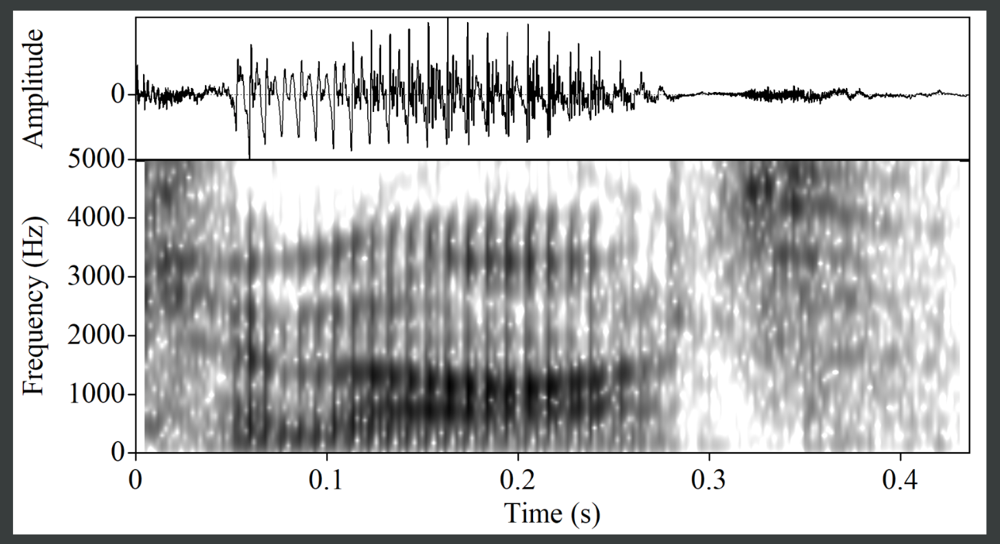

## Graphics
{:.no_toc}
### Segmentation
{:.no_toc}
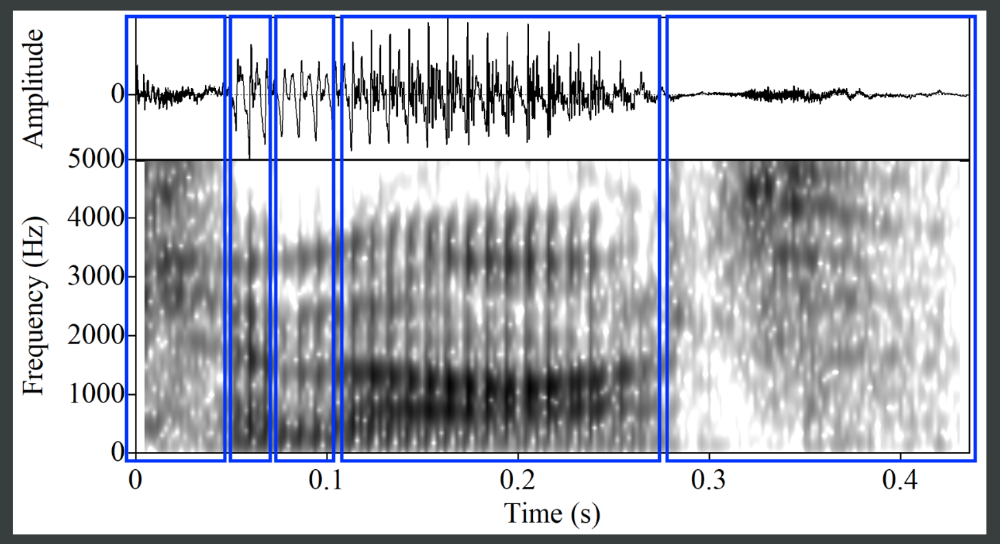

### Voicing
{:.no_toc}
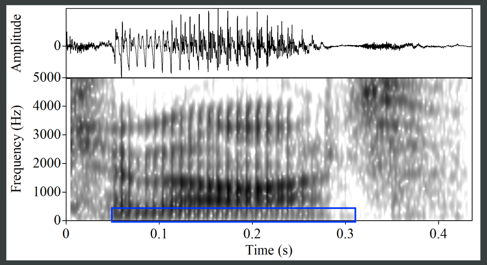

### Formants
{:.no_toc}

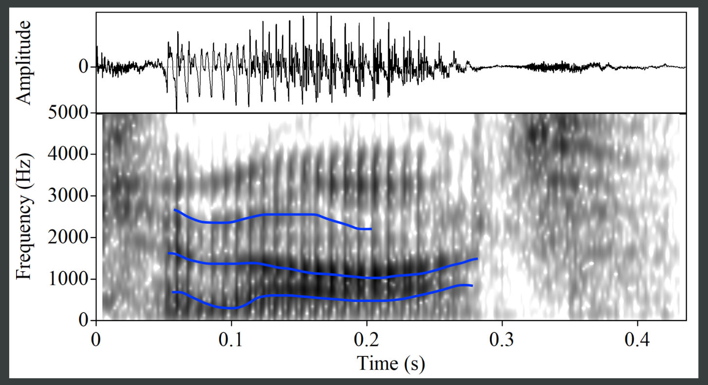

## Step 5: First Guess
{:.no_toc}

* **Segment 1**: This looks like a classic voiceless stop, with a release burst visible right at the beginning of the waveform and a longer period of aspiration. (Foreshadowing) I'm thinking that there's a consonant cluster onset, which is going to make place of articulation more difficult to nail down.
* **Segment 2**: This segment is so short but obviously different than what comes directly after. There are visible formants and pretty high amplitude, so I'm thinking it could be an approximant. But that doesn't make sense for the middle of a cluster?
* **Segment 3**: This looks like a lower amplitude segment, with airly stable formants To me that is screaming for a nasal or a light [l].
* **Segment 4**: This long vowel (or vowels) has the highest amplitude, with a high F1 and fairly low F2. I'm thinking it's either a diphthong or two vowels next to one another.
* **Segment 5**: This segment looks weird. There's a little bit of high-concentration energy around 5000 Hz, but it's not drastic. I'm thinking this is an /-s/ morpheme given its end of word position, but I'm also curious whether the blip around 280ms is a release burst.

My first guess is:
```diff
-p
-l
-aʊ
-ɚ
-z
```

Not looking great.
## Revision
{:.no_toc}

I'll revise to a voiceless version of the /-s/ morpheme, and switch the place of the first stop. I'll also try another approximant for those segments 2-3 in hopes of getting more info.

My second guess is:
```diff
+k
-ɹ
-oʊ
!t
-s
```

Huh, okay so what I thought was a final sibilant must be the [t] stop. I've run out of approximants for segments 2-3, so there must be a nasal there. Since there's no k+nasal clusters in English, segment 2 must be a very short unstressed vowel.

My third guess is:
```diff
+k
+ə
+n
+a
+t
```
## Postmortem
{:.no_toc}

This is a word where I never would have guessed that that is how CMU transcribes the phones. What is going on with that first schwa? Looking at the spectorgram in hindsight, F2 is fairly high and F1 low, and listening to the audio it sounds more like [ɪ] than [ə].

<audio controls>
  <source src="https://nascl.rc.nau.edu/MALD/CANNOT.wav" type="audio/wav">
  Your browser does not support the audio element.
</audio>

# May 12, 2025

## Original Spectrogram
{:.no_toc}
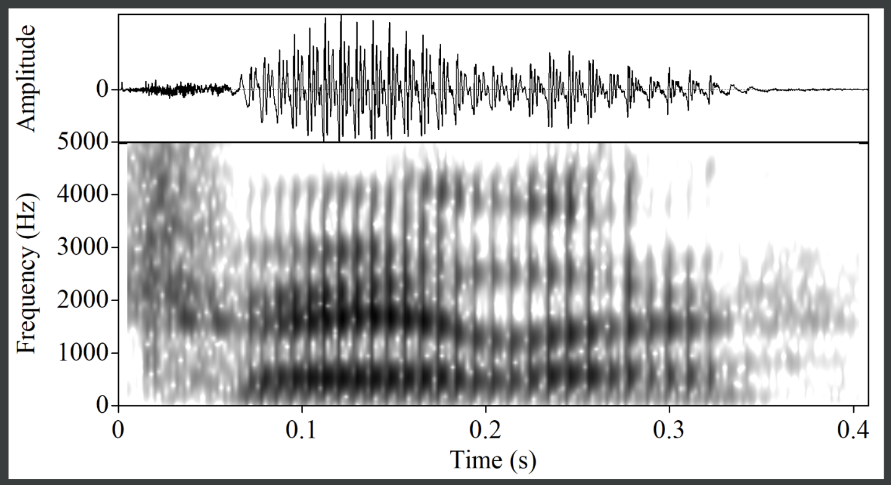

## Graphics
{:.no_toc}

### Segmentation
{:.no_toc}

The segmentation is confusing to me. What makes it unclear is that there's a lot of sonorant segments next to one another, and because of that there aren't clear temporal transitions. There may be a sneaky middle segment, or something showing up as weak formants at the end of the word. 

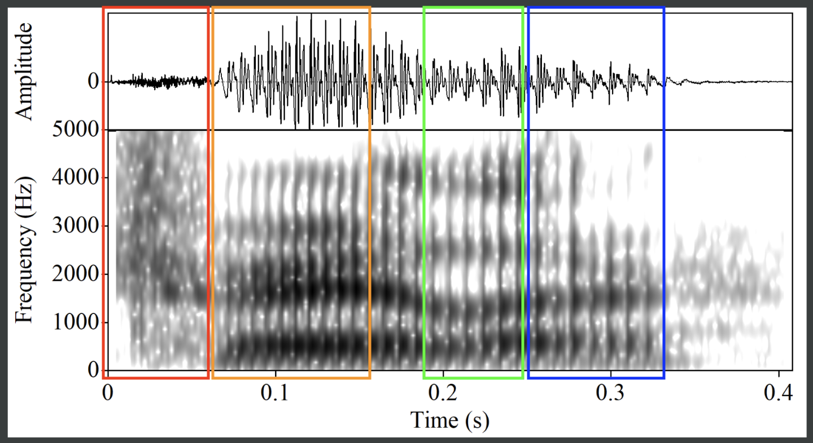

### Voicing
{:.no_toc}
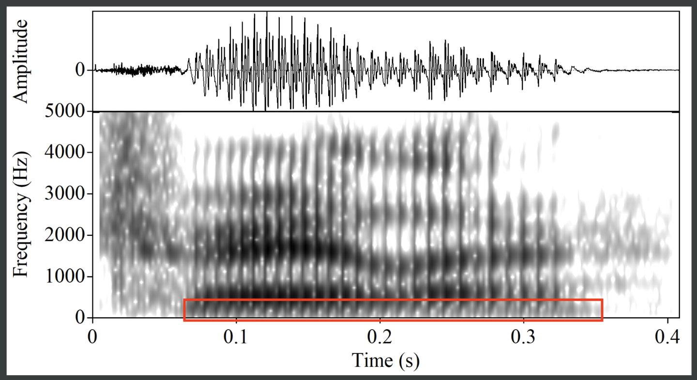

### Formants
{:.no_toc}

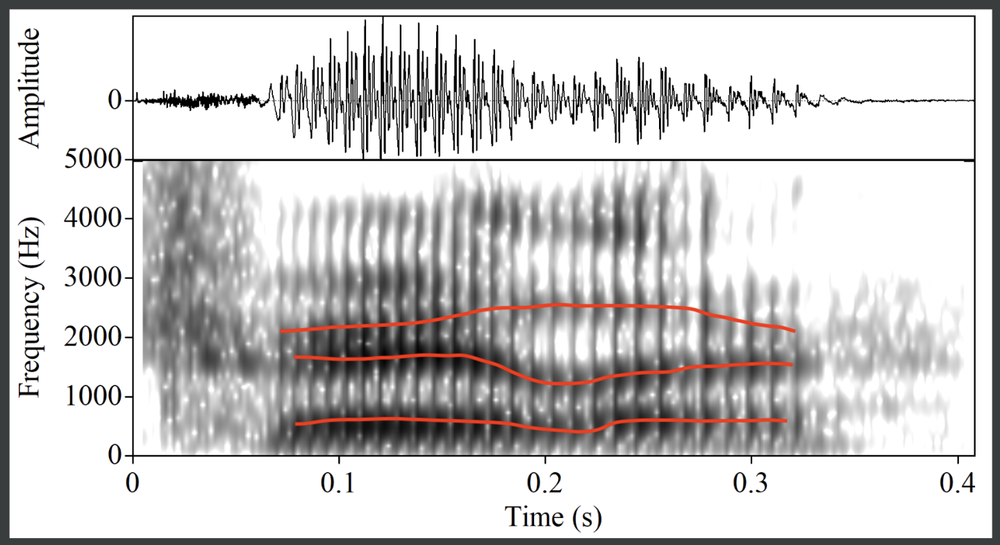

## First Guess
{:.no_toc}

* **Segment 1 (red)**: I think this is a stop. If I look on the waveform, it seems like there's a tiny release burst right at the beginning. The long period of aspiration suggests we're looking at [p, t, k]. I don't see strong formant transitions, although F2 and F3 are fairly close together. That points me toward [k] as a first guess.
* **Segment 2 (orange)**: This segment has high amplitude wiwth clear formants and a lack of zeros, so it must be a stressed vowel. F1 is mid and F2 is mid-high and increasing, so we're looking for something in the center-front of the vowel space. The increasing F1 makes me suspicious of [eɪ].
* **Segment 3 (green)**: This segment has low amplitude, lowering of F2, and zeros in between formants. This makes me believe we're looking at an approximant or nasal with formant-lowering properties, which means [w,l,m].
* **Segment 4 (blue)**: The glottal pulses here are really irregular, which is making it hard to tell what's going on here. I'm thinking that maybe it's an instressed vowel. F3 droops down quite a bit, so maybe it's schwar. The middling F1 and F2 also support this idea.
* **Segment 5**: I'm going to start with the assumption that there's another approximant in between the orange and green segments. Phonotactically an approximant makes the most sense, so I'm thinking [l]. I don't see the velar pinch I'd expect, so this is more of a confident guess with little evidence.

My first guess is
```diff
-k
!eɪ
!l
-m
!ɚ
```
## Revision
{:.no_toc}

Hmm, so my segmentation was wrong in a way that I didn't expect. What if the dip in F3 that I saw at the beginning was because of an [ɹ] in an onset cluster?

My second guess is 
```diff
+t
+ɹ
+eɪ
+l
+ɚ
```

## Postmortem
{:.no_toc}

I think the sign of the [ɹ] existing is most evident in the amplitude in the waveform. I also think the little blip before the regular periodic pattern is an air pocket releasing when the tongue moves anteriorly to make the [ɹ].

# May 9, 2025

## Original Spectrogram
{:.no_toc}
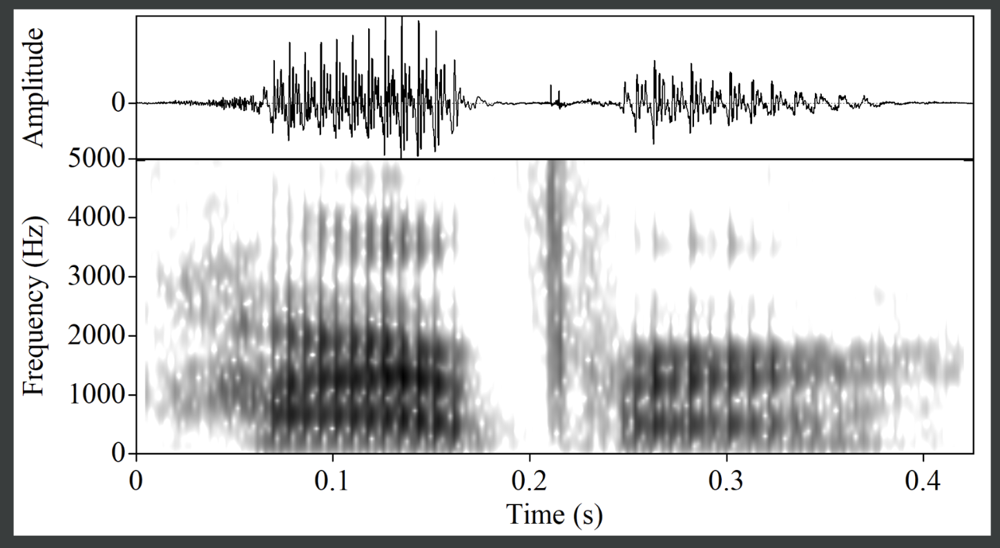

## Graphics
{:.no_toc}

### Segmentation
{:.no_toc}

I am a little nervous about this segmentation. My one worry is that what I've called a first segment (and that I think is a fricative of some kind) is actually a weird-looking glottal stop for an onset-less first syllable.
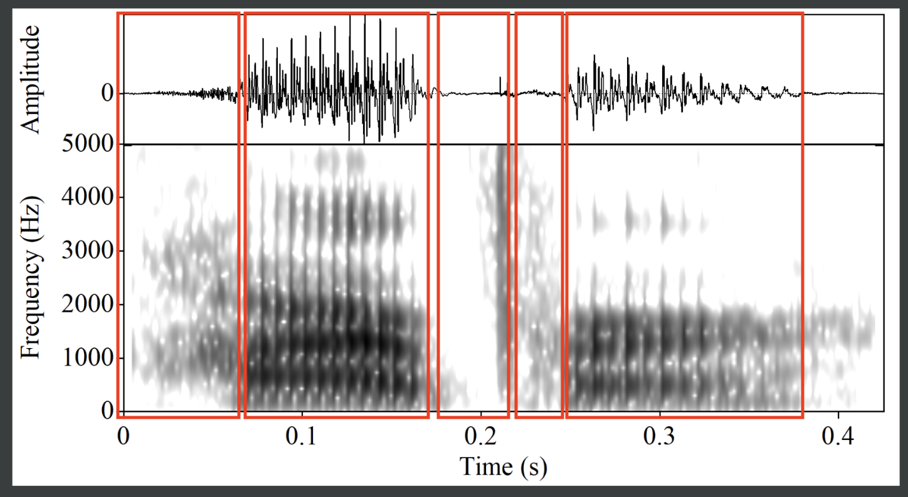

### Voicing
{:.no_toc}
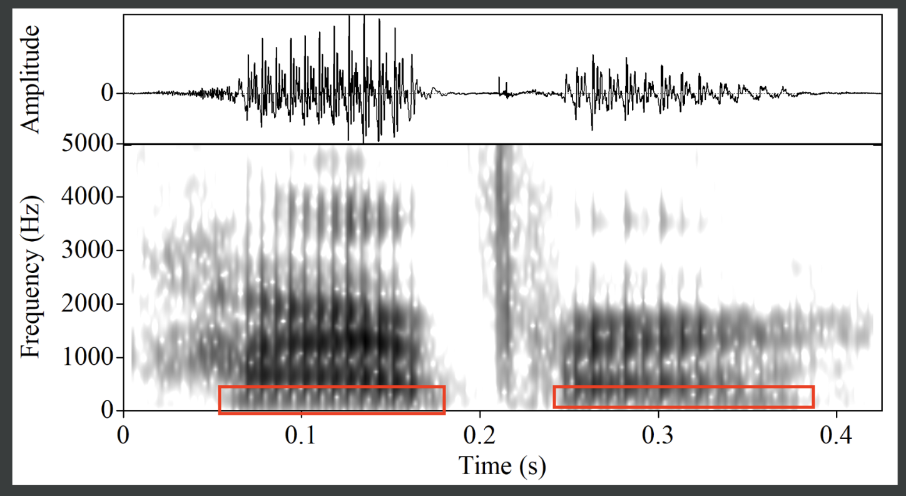

### Formants
{:.no_toc}
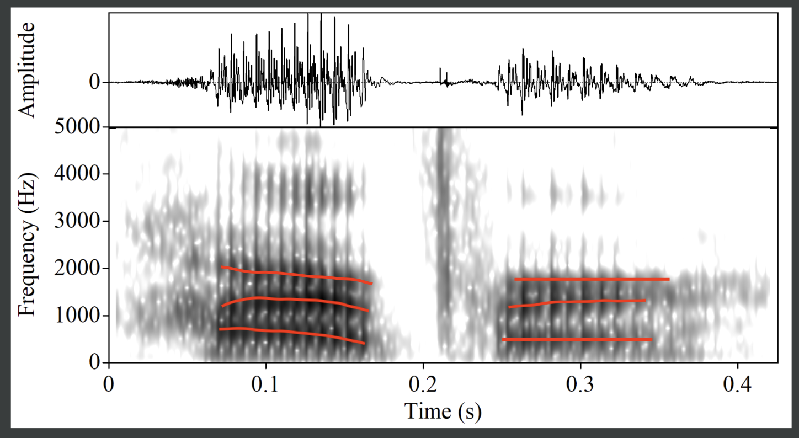

## First Guess
{:.no_toc}

* **Segment 1**: Assuming this segmentation, what I see here is a low amplitude smear-y sound with just the suggestion of formants. Looking in the waveform I don't see any release bursts, so I think this is a non-sibilant fricative. It's not voiced, so that leaves [f, θ, h] as options. I don't have strong opinions, other than maybe it's too quiet for [h].
* **Segment 2**: This is a high amplitude, long sound with clear formants, so must be our stressed vowel. F2 is low and F1 is high, suggesting that this is a low-back vowel. There is some movement, but for now I'm thinking that that is caused by formant transitions.
* **Segment 3**: Here we see a clear closure and release burst, followed by what looks like very brief aspiration. This could either mean that it is a voiced stop, or what I think is more likely is that it is an unaspirated voiceless stop in a consonant cluster. Between [p, t, k], the little bit of dipping in the formants before has me thinking [p].
* **Segment 4**: This segment is very low amplitude with no visible formants. In an different position I would call it a fricative, but I'm thinking that since it follows a stop it could be a devoiced approximant like [l].
* **Segment 5**: This has lower amplitude than the stressed vowel, but the formants are staying clear. F1 and F2 are kind of middle of the pack, with F2 on the lower side. This suggests some kind of central, maybe back vowel. It's long for a word-final schwa, so maybe a schwar even though nothing interesting is happening with F3.

My first guess is 
```diff
-f
+a
!p
-l
+ɚ
```

## Revision
{:.no_toc}

Uh-oh, does that mean there's something wrong with the segmentation, or is it that the release of the p is not visible from the start of the word? It really doesn't look like there's a release in the beginning, so I think maybe what I saw as a voiceless approximant after the stop is just an inconsistent amount of aspiration after the closure, Then the segment after the stressed vowel could be a rhotic, since there is some movement of F3.

My second guess is 
```diff
+h
+a
+ɹ
+p
+ɚ
```
Woohoo!

## Postmortem
{:.no_toc}

I think what would have helped me to see the missing [ɹ] would have been to look more carefully at the amplitude changes of the waveform. But still, they aren't going in the direction I would expect (I want the vowel to be louder). It is also hard because all of the formants are dipping down, not just F3. So there is an overlap between the transition for [ɹ] and the one for [p].

# May 8, 2025

## Original Spectrogram
{:.no_toc}
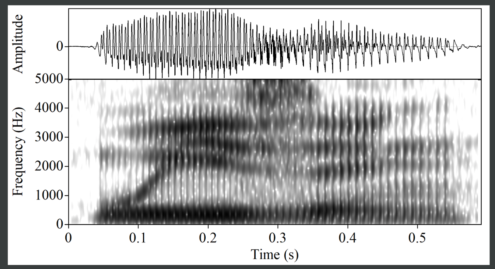

## Graphics
{:.no_toc}

### Segmentation
{:.no_toc}
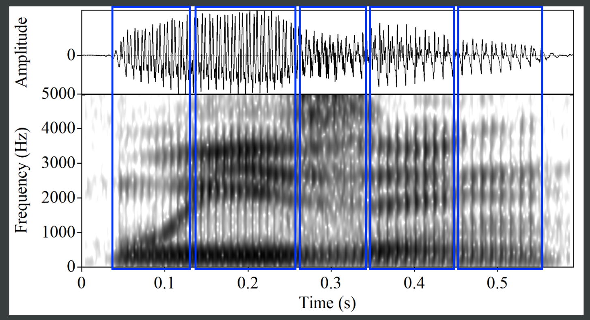

### Voicing
{:.no_toc}
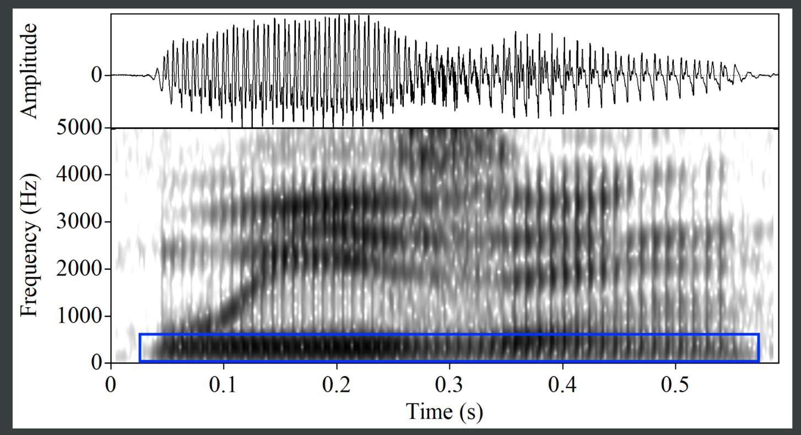

### Formants
{:.no_toc}
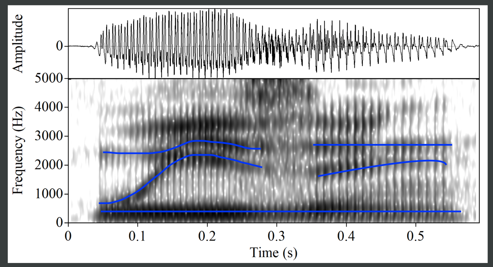

## First Guess
{:.no_toc}

Wow, is is a super sonorant word. The only easy part of segmenting this is the central segment, where the formants drop off. I'm assuming that the silence at the beginning is just a little bit of prevoicing, because I don't see a strong closure on the waveform and I already have 5 segments without a stop. I tried to learn from yesterday and use the waveform as a primary guide for segmentation this time.

* **Segment 1**: This is in a syllable onset position, so should be some kind of consonant. It is fairly high amplitude, with clear formants, very low F2 and mid-low F1. I believe that this makes it an approximant, and based on the F2 value I think [w] is most likely (should look like [u]).
* **Segment 2**: This is a high amplitude, long sound with clear formants, so must be our stressed vowel. F2 is super high and F1 is still mid-low. This puts us at the front top of the vowel space. Based on how high F2 is I'm going to start with [i].
* **Segment 3**: This is the only segment where the formants seem to die down. There is a voicing bar, and a center of gravity of the frequencies above 5000 Hz. So me that sounds like a textbook [z].
* **Segment 4**: I believe this is the unstressed vowel, since it is still fairly high amplitude with clear formants, and is just a little shorter than segment 2. F2 has only dropped off slightly. Since it's unstressed and still in the front of the vowel space, I'm very confident in guessing [ɪ].
* **Segment 5**: Here we see the amplitude dropping off, but the formants are staying clear. It doesn't look quiet enough for a non-sibilant fricative, so it's either a nasal, approximant, or a fading vowel. I can almost hallucinate velar pinch, which I would love because it goes well with the previous guess to make the \<ing\> morpheme.

My first guess is 
```diff
+w
+i
+z
+ɪ
+ŋ
```

Woohoo! I feel vindicated from my poor performance yesterday.

# May 7, 2025

## Original Spectrogram
{:.no_toc}
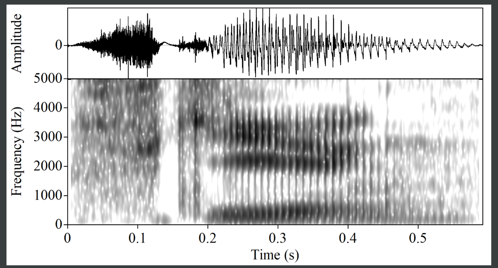

## Graphics
{:.no_toc}

### Segmentation
{:.no_toc}
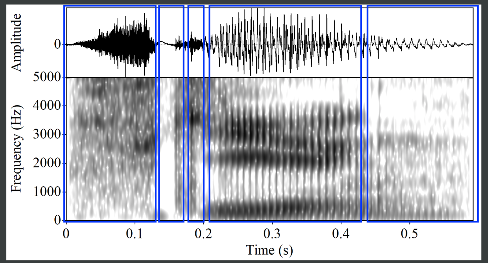

### Voicing
{:.no_toc}
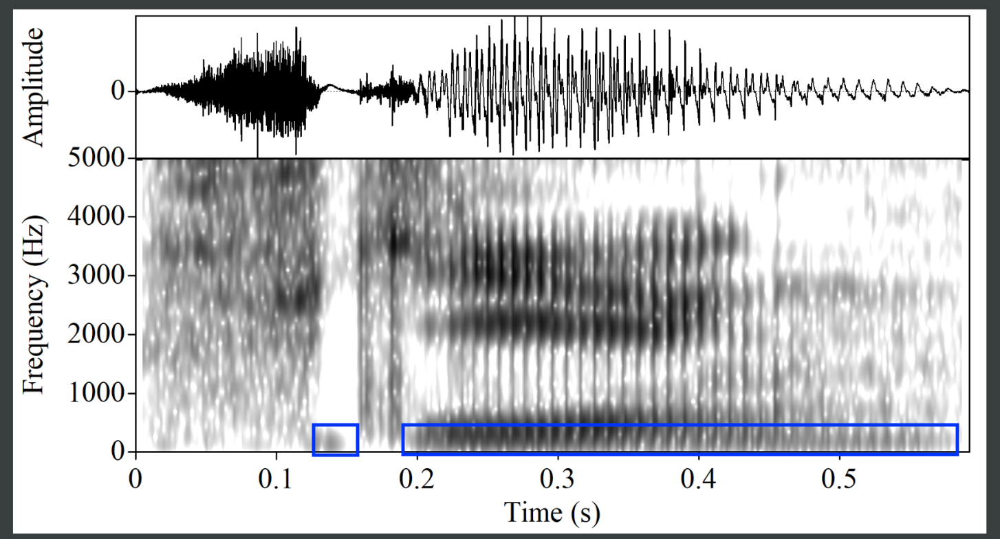

### Formants
{:.no_toc}

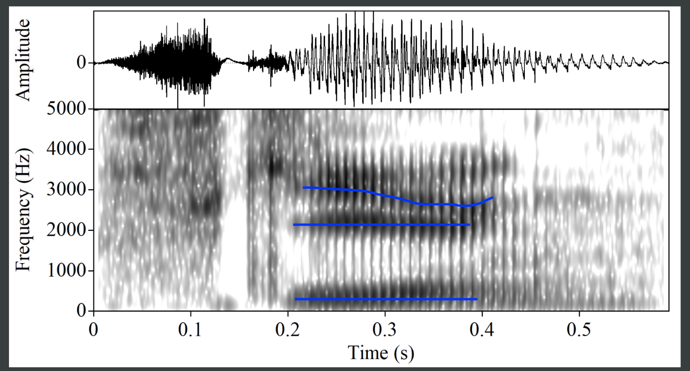

## First Guess
{:.no_toc}

The segmentation today is more confusing to me, but I drew these boundaries mainly going off of the strong vertical lines I see in the spectrogram, indicating release bursts.

* **Segment 1**: This has a smear of frequencies and a very high amplitude for an obstruent, so I think it must be a sibilant. I don't see a center of gravity very clearly, which may mean it's above 5000 Hz. Combined with the word position and lack of voicing bar, I think it's safe to say that this is [s]
* **Segment 2-3**: The second segment segment is clearly a stop, with a defined closure and release burst. It also looks like it precedes another closure. There are few consonant clusters in English that fit this pattern: \<spl\>, \<spr\>, \<str\>, \<skr\>, \<scl\>. Of those, ending in [l] I think is more likely for this spectrogram, as an unvoiced [l] is likely to look fricated. \<spl\> is more frequent than \<scl\>, so I go with the former.
* **Segment 4**: We see clear formants for a vowel, with a low F1 and VERY high F2. There's a little dip in F3 that could be rhoticity, but I'm not sure. What I do know is this should be at the very front of the vowel space.
* **Segment 5**: This is the segment I'm least confident in. The amplitude from the vowel dies gradually, so there may be a heavily released nasal, or some kind of word-final non-sibilant fricative, which is uncommon in English. I don't see evidence of a release burst in the spectrogram or the waveform, so learning against a stop.

I'm going to go with a word for my first guess.

```diff
+s
-p
-l
!i
-n
```

## Revision
{:.no_toc}

Huh, guess the double releases I saw in what I called segments 2-3 were a red herring. I'll have to pick another stop to go there, and since I don't see velar pinch I'll go with [t]. Now for the final 2 segments after the vowel. This is a nasal or an approximant followed by either a stop or a fricative. The words I'm thinking of that fit that are \<steals\> \<steeled\>, \<steams\>, and \<steamed\>. Of these, I think the energy is still too low for a final [z], so I'll say that the blip at 450 ms is a release for a [d]. Between [m] and [l], there are a couple of things I'm looking for. First, [l] and [d] have the same place of articulation, so I could envision a smooth transition with little visible closure, which works here. For [m], since the lips have to open and the tongue make a new closure, I'd expect more of a closure than I see here. Also, in this position in English I would expect [l] to be velarized, which is maybe why that F3 was dipping.

My second guess is
```diff
+s
-t
+i
-l
-d
```

Wow not a great day for the home team. I still have unused hypotheses, so let's try those.

My third guess is
```diff
+s
+k
+i
-m
-z
```

Rats, I am really batting zero out here today. I need to backtrack and look for more clues. Theres is a dip in the amplitude during what I've been calling "the vowel." What if this is a disyllabic word and the second syllable doesn't have an onset? That would explain the change in amplitude and also where this extra segment is coming from. The only word I can think of with that pattern is \<skiing\>, so I'll try that.

My fourth guess is
```diff
+s
+k
+i
+ɪ
+ŋ
```

Woo hoo!

## Postmortem
{:.no_toc}

What I learned from today is: don't ignore cues from the waveform! I am still chewing on why it looks like that [k] is released twice.

# May 6, 2025

## Original Spectrogram
{:.no_toc}
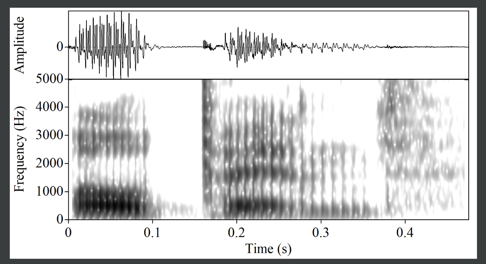

## Graphics
{:.no_toc}

### Segmentation
{:.no_toc}
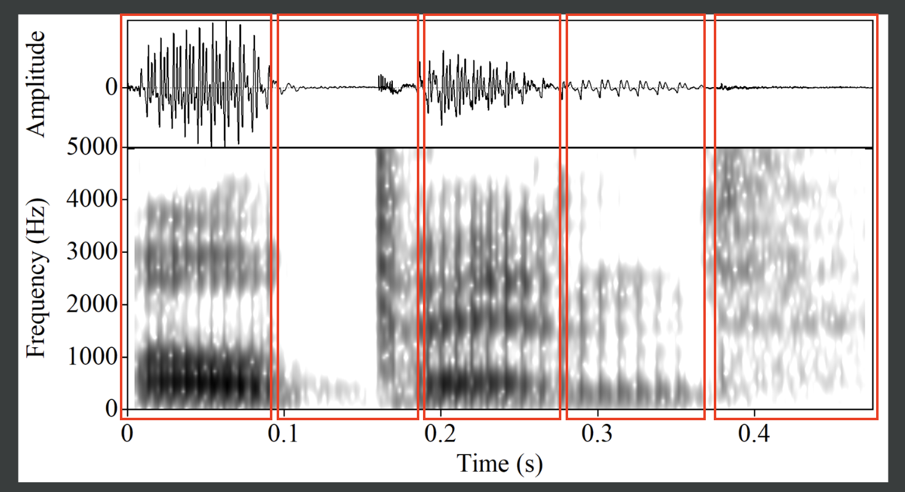

### Voicing
{:.no_toc}
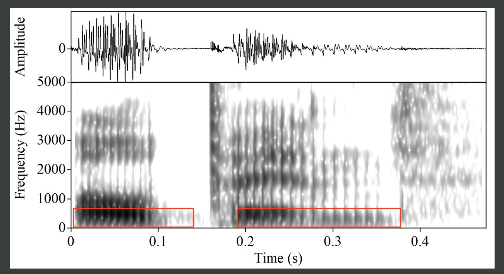

### Manner of Articulation
{:.no_toc}


### Formants
{:.no_toc}

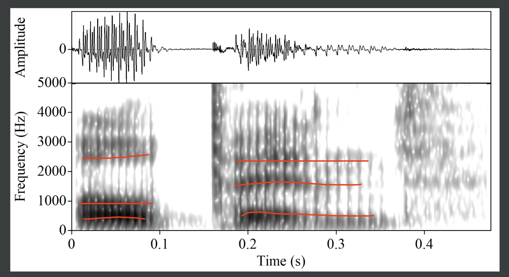

## First Guess
{:.no_toc}

Today I got to do the gramle with my incredible Phonetics class.  This is our rationale:

* **Segment 1**: This segment is loud, with clear formants, so probably a stressed vowel. F1 is lowish, and F2 is very low. We said that it looks a little low to be a diphthong with a lot of movement, but we're looking for a higher back vowel.
* **Segment 2**: This has the classic appearance of a stop on the spectrogram: a closure where the only thing happening is voicing, followed by a strong vertical line for the release, and then a short period of aspiration. We didn't see velar pinch or any other strong formant transitions. We were skeptical of the voicing but combined with the short positive VOT unwilling to rule it out. This made our candidates [p, b, t, d]. We said that there was only subtle donwturn of the formants following the segment, so we were less likely to pick a bilabial.
* **Segment 3**: We saw clear formants with lower amplitude than segment 1, suggesting that this is an unstressed vowel. We considered [ə] and [ɪ], and since F2 is fairly high especially nearer to the end of the segment decided to start with the latter.
* **Segment 4**: We saw light formants with lots of zeros and low amplitude overall. We discussed that the formants mean this is either a nasal, approximant, or a fricative. Because of the low amplitude we ruled out approximants. We also ruled out all of the voiceless fricatives because we saw a clear voicing bar, and ruled out sibilants because of the lack of high energy noise. We also ruled out [ŋ] since we don't see velar pinch. This left us with [m, n, v, ð], and we decided to use phonotactics to pick from these.
* **Segment 5**: We observed a smear across the frequencies, but no clear center of energy. We also saw what may be a release burst in the waveform, but no clear vertical line in the spectrogram. We concluded based on this that it is either a low frequency sibilant [ʃ, ʒ], or a really quietly released stop. We didn't make claims about voicing even though there is no voicing bar, since final devoicing is so common.

Our first guess was:
```diff
-u
!d
-ɪ
+n
-ʃ
```

## Revision
{:.no_toc}

After viewing what we got partially right, we were confident that the last segment should be [d]. We talked about not wanting to change the place in the vowel space we're looking for our first segment, but thought that maybe [oʊ] would work since the formants don't move very far and it can be on the shorter side for diphthongs. When we combined that with what was left in our hypothesized candidates for segments 2 and 3, we ended up on the word \<opened\>.

Our second guess was 
```diff
+oʊ
+p
+ə
+n
+d
```

Woo hoo!
## Postmortem
{:.no_toc}
We listened to the audio, and the final [d] was in fact devoiced. Not too shabby for only being in Week 6 of 10!

# May 5, 2025

## Original Spectrogram
{:.no_toc}
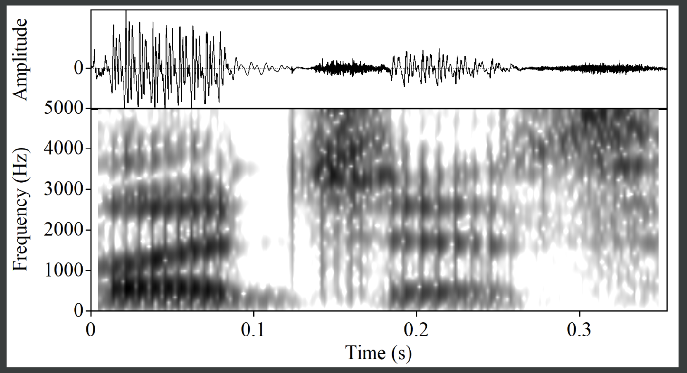

## Graphics
{:.no_toc}

### Segmentation
{:.no_toc}
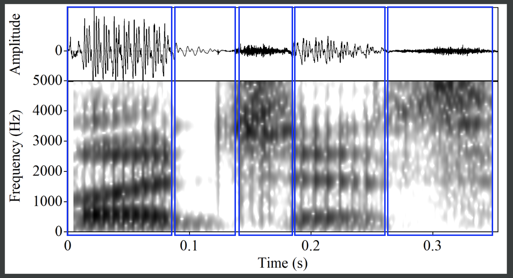

### Voicing
{:.no_toc}
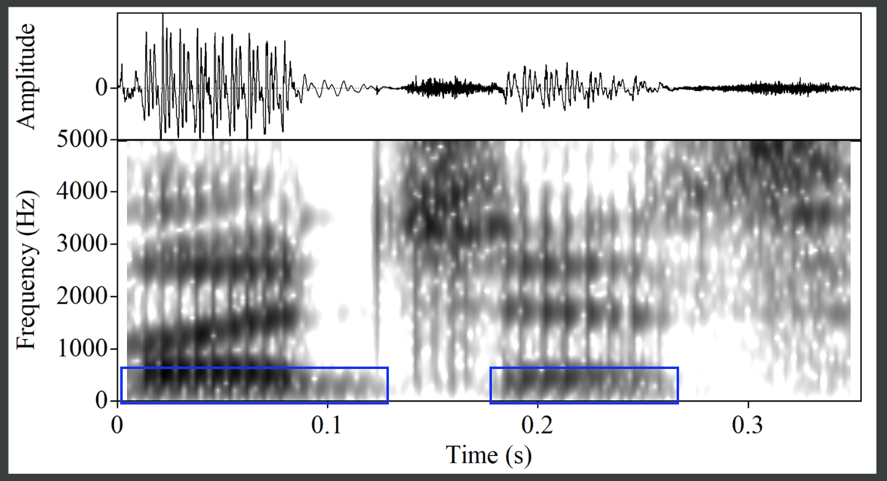

### Formants
{:.no_toc}

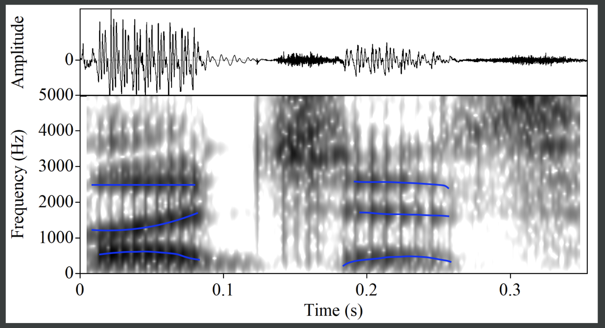

## First Guess
{:.no_toc}

* **Segment 1**: This segment is loud, with clear formants, so I think it's the stressed vowel. F1 is mid-high, and F2 starts very low and ends high. That is the kind of movement I'd expect from a formant transition (so maybe velar pinch on the next segment), or from a diphthong with a back nucleus and advanced offglide, like [aɪ] or [ɔɪ]. It is a little short for a diphthong though... I'm going to start with a low monophthong.
* **Segment 2**: This has the classic appearance of a stop on the spectrogram: a closure where the only thing happening is voicing, followed by a strong vertical line for the release, and then a short period of aspiration. The release is fairly soft, but it is followed by a fricative show that doesn't rule out the voiceless stops. I think the voicing bar here is an unreliable cue, but should probably give higher priority to [b, d, g] just in case.
* **Segment 3**: This first one looks like an [ʃ] to me, because it is voiceless and the center of gravity is medium-high, around 3500 Hz.
* **Segment 4**: We see clear formants, a lower amplitud, and it's between two fricatives so I think this is the unstressed vowel. F1 is low and F2 is high and they're both stable, so it's a high front vowel and probably a monophthong, either [i] or [ɪ]. With the amount of creak we're seeing, I'm a little more inclined to say [ɪ].
* **Segment 5**: This looks a lot like segment 3, except the center of the frication energy is higher up. The lack of voicing would indicate that this should be [s] then, but since it's after a vowel it could also be phonemically a /z/.

Nothing is coming to mind, so I'll not start with a word.
My first guess is
```diff
-a
-k
-ʃ
+ɪ
-z
```
Wow, I don't think I've gotten so wrong so far.

## Revision
{:.no_toc}

The alternative to my idea about the fricativeis that we are actually looking at affricates. If that's the case, then when I thought was a closure for a stop is the closure for the affricate. On second loo, right at the beginning it does look like there's a release burst in the waveform so there might be a stop there. Since F2 starts low there might be lengthening for lip pursing. Combined with the short aspiration I'm guessing this is a [b].

### Resegmentation
{:.no_toc}

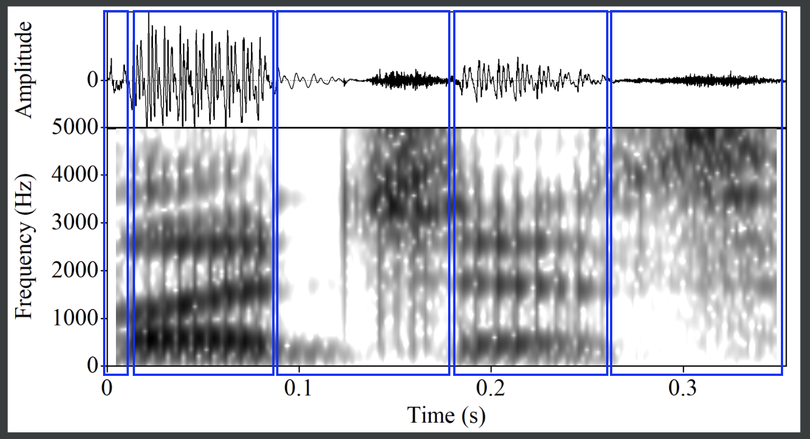


My second guess is
```diff
-b
-aɪ
-tʃ
+ɪ
!dʒ
```

I'm sort of at a loss for that last segment, but maybe it's a wildly aspirated [t] for \<budget\>

My third guess is 
```diff
+b
+ʌ
+dʒ
+ɪ
+t
```
## Postmortem
{:.no_toc}

<audio controls>
  <source src="https://nascl.rc.nau.edu/MALD/BUDGET.wav" type="audio/wav">
  Your browser does not support the audio element.
</audio>


If you listen to the [t], it is really weird. I think what I've learned is to make sure that I'm looking at both the waveform and the spectrogram, and to remember my own rule that weird things happen at the end of words.

# May 1, 2025

Today we did the whole gramle in my Phonetics class. I unfortunately forgot to take a screenshot but the word was \<furbish\>. We got the first fricative and the final coda very quickly. The first coda and second onset were really troubling for the class. We believed that the stressed vowel was something with a mid-F1 and mid-low-F2, and started with wedge based on that. In the end, it was a central vowel but we failed to see the rhoticity. What threw everyone off was the manner of articulation of the third segment. There were shadowy formants that had us going down the nasal, approximant, fricative line. We did notice at the very end what looked like a release burst in the waveform, that enabled us to guess \<foppish\>. But in the end we had a 50/50 toss up between fervish (I still don't know what that means) and furbish.

Our guesses were:

1:
```diff
+f
-ʌ
-n
-ə
-s
```

2:
```diff
+f
-u
-l
+ɪ
+ʃ
```

3:
```diff
+f
-æ
-m
+ɪ
+ʃ
```

4:
```diff
+f
-a
-p
+ɪ
+ʃ
```

5:
```diff
+f
+ɝ
-v
+ɪ
+ʃ
```
